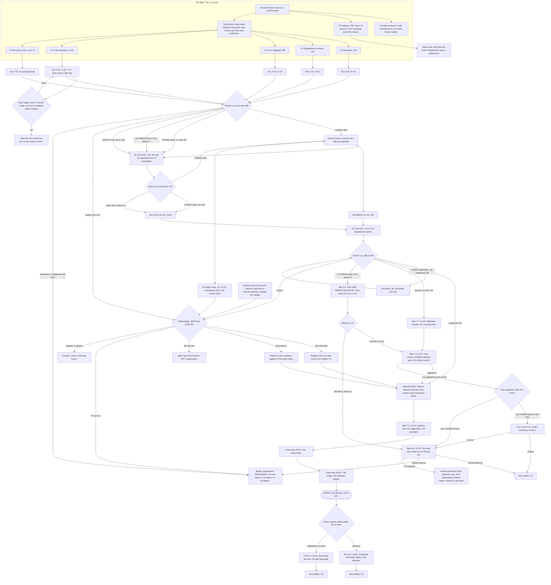

# Horizon Series Campaign Playbook
## Jarurat Care Foundation | Horizon IV, Saturday 26 September 2026 | JCF-Mailer execution spec + teaching document

**Status of this document.** Every capability claim here has been checked against the JCF-Mailer source. Where the platform cannot do a thing, this document says so plainly and names either the person who must do it by hand or the code that must be written. Where a number has no local baseline, it is labelled ESTIMATE. Nothing in this document is a forecast dressed as a fact.

**Audience.** Section 1, 3, 5, 6 and 10 are for the marketing team. Sections 2, 4, 7, 8 and 9 are the operator's execution spec. Read all of it once before Day 1.

---

# 1. The one-page summary

## What we did in June

Two blast emails through Postmark to 3,367 addresses. 163 registrants were on the board by send time, of mixed and unknown provenance. On 27 June, 209 unique addresses attended. **Eighteen of those 209 were on the emailed list.** 191 arrived through WhatsApp forwards, social, word of mouth and direct outreach.

No bounce number, no open number and no complaint number from that send survives anywhere on this machine. Postmark's Activity export may or may not be recoverable. So the honest position is this: **we do not know what the June email programme contributed.** We know it contributed something, because clinicians clicked. We know it was not the growth engine, because 91 percent of attendees never received it.

## What changes

| From | To |
|---|---|
| 2 emails | 8 stages over 43 days, 45 campaign rows, 24 distinct bodies |
| 1 audience | 5 pre-send cohorts (built before email 1 goes out) plus 15 behavioural cohorts cut after each stage |
| No exit rules beyond unsubscribe | 6 permanent exits, 3 event-scoped exits, a sunset path and a frequency cap |
| No measurement of incrementality | A 335-person no-mail holdout held for the whole edition |
| Open rate from an inflated legacy counter | HUMAN-classified opens only, read once at a fixed offset and frozen |
| Registration proven by nothing | Registration proven by the Zoom registrant export, reconciled daily by a human |
| Replies invisible | Replies read twice daily by a named human on a 24-hour SLA, with a 2-day code fix to make them machine-countable |

## The honest expected gain

| Outcome | June | Horizon IV target | Confidence |
|---|---|---|---|
| List-attributable registrations | Unknown. 163 total, provenance mixed | 220-300 | ESTIMATE. Wide error bars. |
| True incremental registrations caused by email | **Unknown and unknowable in June** | Measured for the first time by the HZN-T0 holdout | The holdout resolves a lift of 4 percentage points or more. Below that it will report "cannot resolve", not "no effect". |
| Attendance | 209 unique attendees | 35-45 percent of registrants, so 100-155 live from 280-350 registered | ESTIMATE, anchored on the Horizon I 80-minute average watch time |
| Bounce rate, stage 1 cold | Unknown | Under 4 percent on the first 600-address wave, under 1.5 percent thereafter | ESTIMATE. The first wave IS the measurement. |
| Complaint rate | Unknown | Under 0.08 percent every stage. Gmail's bulk-sender line is 0.10 percent. | Hard gate, not a target |

**What is a real win:** knowing, for the first time, how many registrations email actually causes. A cohort-differentiated flow that does not send "Register now" to people who already registered. A reply loop that a human actually answers. A sunset path that protects the sending domain for Horizon V.

**What is marginal:** subject line optimisation. At 1,300 to 1,400 people per arm on a 3 percent click base, the smallest click difference this list can honestly resolve is about 2 percentage points, and no realistic copy change moves clicks by that much. Only one test in this programme (sender identity, HZN-T1) is genuinely powered.

**What is the biggest lever and is not an email at all:** 191 of 209 June attendees came from off-list channels. Until that ratio moves, the forwardable asset and the peer-to-peer clinician send deserve more investment than another reminder stage. That is stated here so nobody spends a month A/B testing subject lines while the actual growth channel goes unmeasured.

**What this costs.** Because JCF-Mailer has no journeys, no dynamic segments, no variant column and no conversion tracking, every branch in this flow is a documented human loop: pull a HUMAN-classified set out of the database, diff it against a Zoom CSV, import it as a new static list, create a campaign, schedule it. That is roughly **45 campaign rows and 45 dated mailing lists**, about 6 to 8 operator hours per week for six weeks, plus two people holding a 24-hour reply SLA for the two weeks around the ask. Budget it honestly or cut stages, but do not pretend the platform will do it.

---

# 2. The platform: what JCF-Mailer does, and what must be built first

## 2.1 What already works, and works well

| Capability | Verdict | Use it for |
|---|---|---|
| **Open classification (HUMAN / APPLE_MPP / PROXY / BOT)** | Strongest part of the platform | Every open number in this playbook. `OpenClassifier` treats a bare AppleWebKit UA with no Version/Safari/Chrome tail as MPP, corroborated by Apple's 17.0.0.0/8. About 80 scanner and unfurler tokens. Raw UA, IP and secondsSinceSent are persisted, so verdicts can be re-run. |
| **Click tracking with per-destination attribution** | Works | `GET /api/analytics/links` groups by destination URL string and ranks by unique clickers. **There are no link IDs and no link labels**, so two buttons pointing at the same URL are one row. Every asset in this flow therefore gets a distinct UTM-tagged URL. |
| **Unsubscribe and global suppression** | Complete and enforced | List-Unsubscribe and List-Unsubscribe-Post one-click headers. Enforced at three points: queue time, send time, and suppression time (`skipPendingForEmail` flips in-flight PENDING rows to SKIPPED). Marketing mail literally cannot ship without an unsubscribe link. |
| **Pre-send safety gate** | Works and gates scheduled fires too | `SafetyCheckService.assertSafeToSend` runs on the caller's thread inside `CampaignService.send`, so a 07:10 unattended fire is gated. Checks SES account health, bounce and complaint history, list existence, and remaining 24h quota. |
| **Scheduling** | Works, with caveats | One absolute `LocalDateTime` per campaign, polled every 60 seconds. See the timezone blocker below. |
| **Merge tokens in the body** | Works, three tokens only | `{{NAME}}`, `{{FIRST_NAME}}`, `{{EMAIL}}`, plus `{{UNSUBSCRIBE_LINK}}` and `{{TRACK:url}}`. `FIRST_NAME` has honorific handling, so "Dr. Akanksha Chichra" greets as "Dr. Akanksha". |
| **CSV import with dry run** | Works well | `POST /api/campaignsplus/import` streams, reports per-row issues, and supports `dryRun=true`. This is the workhorse of the whole flow. |
| **Verification** | Works for what it can see. See P0-2. | Catches malformed syntax, NXDOMAIN, null MX, no MX, disposable domains. |

## 2.2 Corrections to widely-held beliefs about this platform

Three things people believe about JCF-Mailer that are wrong, and each one changes a plan:

1. **`{{FIRST_NAME}}` does not render empty on a blank name.** `CampaignService.firstWord()` returns the literal string `there` for a null, blank, or bare-honorific name. So a blank row renders "Dear there," which is clumsy, not broken. **`{{NAME}}` is the token that renders empty**, because `queueFromList` writes `nullif(trim(first||' '||last),'')` and `applyMergeFields` blanks nulls. **Rule: use `{{FIRST_NAME}}` in greetings. Never use `{{NAME}}`.**
2. **Reply detection is days of work, not weeks.** `MailService.BODY_PROPS` already requests `messageId`, `inReplyTo` and `references` from JMAP, and `MessageBody` carries all three. Only `MessageSummary` lacks them, and `MailApiController.message()` simply forgets to put them in the JSON. `CampaignRecipient.messageId` holds the SES message id, which is the local part of the RFC Message-ID SES stamps. So a reply's `In-Reply-To` maps straight back to a recipient row **with no VERP at all**. And `InMemoryMailCredentialStore` is a `ConcurrentHashMap` on a `@Component`, process-wide, not session-scoped: only the HTTP layer pins a mailbox to an `HttpSession`. A `@Scheduled` bean can call `credentials.secretFor("partnership@jarurat.care")` directly once any human has unlocked it since the last restart.
3. **`POST /api/analytics/reclassify` is a no-op as normally used.** It re-runs the *same* classifier over stored rows and rewrites only verdicts that changed. Classification is already computed by that identical classifier at write time. Unless `analytics.prefetchWindowSeconds` or `analytics.appleNetworks` changed between the send and the reclassify, it reports `changed=0`. Running it after every stage is ritual. Run it **once**, at pre-flight, after loading a refreshed Apple egress CIDR list, so every stage is classified under identical rules.

## 2.3 Blockers that must be cleared before Day 1

These are not code tasks. They need a person, a decision or an AWS permission, and they have dates.

### P0-1. Sending identity and domain. Owner: platform owner. Deadline: T-35.

**There is no per-campaign sending domain.** `SesSender.build()` always sets `.fromEmailAddress()` from the single `${aws.ses.fromEmail}` (default `admin@jarurat.care`). `Campaign` overrides only `fromName` and `replyTo`. `SafetyCheckService.checkSenderDomain` and `OverviewApi` both call `ses.identityHealth(${aws.ses.domain})`, one global value. Tracking, click and unsubscribe URLs come from a third global, `${app.domain}` = `https://mailer.jarurat.care`.

**Consequence for this playbook:** every reference to "the fresh horizonevent.info sending domain" and "warm-up rung on the new domain" has been removed. This edition sends from the existing verified `jarurat.care` identity. The cohort ordering in Stage 1 is retained because sending smallest-and-warmest-first is good reputation practice on any domain, but it is not a domain warm-up and must not be described as one.

**If a domain switch is genuinely wanted**, treat it as a platform migration, not a campaign setting: verify `horizonevent.info` as a new SES identity, set `SES_DOMAIN`, `SES_FROM_EMAIL`, `SES_REPLY_TO` and `APP_DOMAIN`, add DNS for the tracking host, restart. Everything the platform sends moves with it, including transactional mail through `/api/v1/transactional/send`. If `jarurat.care` transactional mail must stay put, that needs either a second instance or a code change: add `fromEmail` to `models/Campaign.java`, thread it through `SesSender.Outgoing`, and make `SafetyCheckService.checkSenderDomain` resolve the domain from the campaign rather than the property.

**Also under this owner, and genuinely urgent:** the SES production-access letter told AWS that recipients explicitly register at `jarurat.care/doctor-form` and that mail is strictly transactional. Cohort C4's provenance is a scraped professional listing. Mailing C4 through that identity as declared is the single most likely cause of a production-access revocation. Either amend the declaration with AWS or route C4 elsewhere, **before Day 4**.

### P0-2. Verification is not a bounce gate on this list. Owner: operator. Decision, not a task.

`SmtpProbe` is off by default (`verification.smtp.enabled=false`) and its own header comment states outbound port 25 is blocked by AWS on these instances, so the probe times out on every connect. Without it, `EmailVerifier` returns UNDELIVERABLE only for malformed syntax, NXDOMAIN, null MX, no MX, or a disposable domain.

On a 92.1 percent free-mail list, **every gmail.com and yahoo.com address returns DELIVERABLE**, including dead accounts. The pre-flight verification run will remove almost nothing and buys zero bounce protection on C4.

Three consequences, all applied in this document:
- Keep the verification run (it catches dead domains and typos cheaply, and `queueFromList` excludes UNDELIVERABLE automatically) but **do not plan around it**. The Day 5 gate is re-planned around the real first-send bounce number, and wave 1 is sized small enough that its bounce rate is the experiment.
- **The Stage 8b "suppress if RISKY or catch-all" criterion is deleted entirely.** RISKY and catch-all verdicts select almost exclusively hospital and institutional domains, because those are the ones that come back catch-all or role-account. That rule would have suppressed our most valuable contacts and spared the dead Gmails. Sunset on engagement only.
- The exit rule freshness window is **90 days**, not 180, because `verification.freshDays=90`. `POST /api/verification/list` also takes a `force` parameter that bypasses it. Keep `force` out of the runbook.

### P0-3. Server timezone. Owner: operator. Deadline: T-32, before anything is scheduled.

`POST /api/campaigns/schedule?when=` does `LocalDateTime.parse(when)` with no zone, and `runDueCampaigns` compares against `LocalDateTime.now()`. Both resolve in the JVM's default timezone. Nothing in `application.properties` sets a timezone. **If the box runs UTC (the AWS default), `2026-08-31T07:10` fires at 12:40 IST**, inside the 11:00-16:00 OPD window this plan explicitly forbids sending in. Every send-hour claim in this document, and the HZN-T3 test in full, is a timezone assertion.

Do this, in order: run `date` on the box, check the JVM zone, set `TZ=Asia/Kolkata` for the service (correct given a single-timezone audience), restart, then schedule a test-send two minutes out and check the arrival timestamp against a phone. Also confirm **only one app instance is running**: `runDueCampaigns` has no cross-process lock, so two instances both fire the same scheduled campaign.

### P0-4. SNS topic and SES configuration set. Owner: whoever holds AWS IAM. Deadline: T-30.

This is not a config toggle. Two independent code comments state the account cannot have an SNS topic at all: `TrackingController`'s deleted-endpoint note says "This account has no SNS topic and the IAM user cannot create one (SNS:CreateTopic is denied)", and `SuppressionService.syncFromSes` repeats it. There is no property value to set until someone with different IAM rights creates the topic and subscribes the endpoint.

Blocked downstream of it: true soft bounces, deferrals, per-message Delivery events, cohort B9, and any per-recipient delivery truth in Section 8.

The task: grant `SNS:CreateTopic` and `SNS:Subscribe`, create the topic, create an SES configuration set publishing Bounce/Complaint/Delivery to it, set `SES_CONFIGURATION_SET` and `jarurat.sns.allowed-topic-arns`, restart.

**If it will not land by T-30, delete cohort B9 from this edition** rather than carrying a rule nobody can evaluate, and state delivery rate as "SES-accepted, lower bound" everywhere it is reported. The live path stays the 15-minute SES suppression-list poll, which is authoritative but delayed and account-level. There is a partial substitute nobody mentions: `messagelog/StalwartDeliveryLog` reads this box's own Stalwart log for verbatim SMTP replies, useful for mail sent through Stalwart, not for SES campaign sends.

### P0-5. There is no way to stop a send in progress. Owner: operator. Runbook entry, not a task.

`Campaign.status` documents PAUSED but nothing in `src/` ever writes it. `CampaignApi` has no pause, abort or stop endpoint. `POST /api/campaigns/delete` refuses while status is SENDING. Once `dispatchAll` is running it drains every PENDING row through 16 concurrent virtual threads at 12/s and cannot be interrupted.

**The only emergency stop today is `systemctl restart` on the app.** `dispatchAll` dies, remaining rows stay PENDING, `campaign.status` is stranded on SENDING, and `POST /api/campaigns/send` resumes the remainder later because `liveRuns` is in-memory so the "already sending" guard is cleared. Write that into the runbook. It is in Section 9.

**The structural mitigation, applied throughout this playbook: no single campaign exceeds 600 recipients.** That is why this flow is 45 campaign rows rather than 20. It bounds the blast radius between checkpoints. It is the price of not having an abort button.

## 2.4 Build queue, in priority order

| # | Build | Effort | Unblocks | Ship by |
|---|---|---|---|---|
| 1 | **Abort endpoint.** Volatile `cancelled` flag on `Progress`, a check at the top of `sendOne`, `POST /api/campaigns/{id}/abort` that sets it. | Tiny. Hours. | The Stage 5 "halt the cold segment" branch, and every kill criterion in this document. | T-30 |
| 2 | **Subject-line merge.** In `CampaignService.sendOne`, replace `campaign.getSubject()` with `ses.renderTransactional(campaign.getSubject(), merge)`. Then add a `TemplateLibraryService.validate()` rule that flags merge tags in a MARKETING subject until it ships. | Tiny. One line plus a lint rule. | Removes the highest-severity copy risk in the flow. Today a `{{FIRST_NAME}}` in a subject ships literally to 3,000 doctors, **and `validate()` will not warn you**, because `mergeFieldsOf` treats FIRST_NAME as a resolvable campaign field. | T-30 |
| 3 | **Stable export paging.** Add `Sort.by("id")` to the `PageRequest.of(page, 500)` calls in `CampaignApi.export` and `AudienceApi` subscriber export. | Tiny. Two lines. | Without it, page boundaries on a 3,000-row export are not stable on Postgres and rows can repeat or be skipped. | T-30 |
| 4 | **`inReplyTo` in the mail API.** Add `out.put("inReplyTo", body.inReplyTo())` to `MailApiController.message()`. | Tiny. One line. | Lets a human paste a message id and get the campaign, immediately. | T-30 |
| 5 | **ReplyScanner + `campaign_reply`.** `@Scheduled(fixedDelay=300_000)` walking `MailService.listMessages` on the inbox folder, `getMessage` on unseen rows, strip `<...@...>` from `inReplyTo`, look up `CampaignRecipientRepository` by `messageId`. Table `campaign_reply(id, campaign_id, recipient_id, subscriber_id, jmap_email_id UNIQUE, subject, intent, received_at, detected_via)`. Guard with `if (credentials.secretFor(mailbox).isEmpty()) return;` and add an ops step "unlock partnership@ after every app restart". | Small. Days. | Cohorts B4-B7 become machine-countable. HZN-T6 becomes runnable. VERP is a **fallback** for replies that strip In-Reply-To, not a prerequisite. | T-20 if possible; this edition runs manually if not |
| 6 | **Conversion capture.** Accept `?token=` on `GET /api/mailer/success` and write a `conversion_event` row before rendering; add `POST /api/v1/conversions` on the API-key-authed `PublicApiV1`; add `conversions`/`conversionRate` to `AnalyticsService.summary`. | Small. | Cohort B2 (clicked, not registered) becomes visible in-platform instead of a daily manual CSV diff. Winner selection becomes meaningful. | Horizon V |
| 7 | **SegmentResolver + `segment` table**, materialising into a static list via `INSERT ... SELECT ... ON CONFLICT DO NOTHING`. Predicates read `tracking_event WHERE classification='HUMAN'`, never `CampaignRecipient.openedAt`. | Medium. | Removes the psql-and-CSV loop that is 60 percent of the operator's time in this flow. | Horizon V |
| 8 | **Variant dimension.** `campaign_variant` table, `variant_key`/`cohort_key` columns on `campaign_recipient`, `tracking_event` and `click_event`, a `VariantAssigner` hashing `SHA-256(experimentKey + ':' + subscriberId)` onto a cumulative weight ladder. | Medium. | Collapses 45 campaigns to about 20 and makes variant-within-cohort cross-tabs possible for the first time. | Horizon VI |
| 9 | **Journeys.** `journey` + `journey_step`, a `JourneyRunner` on a 60-second schedule, a pg advisory lock around the step pick. | Large. | The whole manual loop. Do not start it before 7 and 8 exist. | Later |

---

# 3. The cohort model

## 3.1 The lesson that matters most

> ### Cohorts exist before email 1. They are not something you discover afterwards.
>
> The most common failure in webinar email is to blast everyone once, look at the open report, and *then* start talking about segments. By that point the damage is done: the person who attended your last session and the person whose address you scraped last month both received the same "Register now", and the first one learned that you do not know who they are.
>
> On this list, four groups already exist before a single email goes out this cycle, and they are knowable **from artefacts we already have**: a Zoom attendee log, a Zoom registrant export, an engagement export, and the remainder. Their relationship to Jarurat Care ranges from "was in the room for 92 minutes" to "has never heard of you". Those four groups deserve four different first emails, and they deserve them on day one, not on day fifteen.
>
> Behavioural cohorts (B1-B15) are the *second* layer. They refine what the pre-send cohorts started. A flow that has no pre-send cohorts is not doing segmentation, it is doing damage control.

## 3.2 Pre-send cohorts, built at T-30

Sizes below are the planning ledger. Replace them with the real counts from the pre-flight diff and carry the real numbers forward everywhere.

| ID | Cohort | Source artefact | Est. n | First email |
|---|---|---|---|---|
| **C6** | **Hard exclusion.** Internal monitoring addresses, JCF staff, the founder's own inbox, everything on the pipeline `SUPPRESS_do_not_send` export. | Named exclusion list, diffed against every import | ~15 | Never. |
| **C0** | **Holdout.** No campaign email at all for this edition. Still reachable via social, WhatsApp and word of mouth. | `SHA-256(salt + lowercased email) mod 10 == 0` | 335 | Never, this edition. Same salt every edition so reads pool. |
| **C1** | **Attendees.** Joined the 27 June session live. | `attendeelog_2026_06_27...csv`, deduped, matched to the roster | 207 | S1a |
| **C2** | **Registered no-shows.** | Zoom registrant export minus attendee log | 153 | S1b |
| **C3** | **Prior engaged non-registrants.** Opened or clicked in June, never registered. | Postmark Activity export, **if recoverable**. If it cannot be pulled, this cohort does not exist and folds into C4. | 360 | S1c |
| **C4** | **Cold remainder.** | `horizon-clean.csv` minus C0, C1, C2, C3, C6, minus UNDELIVERABLE verdicts | 2,241 | S1d, in three waves |
| **C5** | **No-name rows.** 12 rows with a blank first name. | The CSV itself | up to 12 | S1e, or fold in. See below. |

**On C5.** Because `{{FIRST_NAME}}` renders `there`, these rows are not broken, only clumsy: they would read "Dear there,". The right answer is to **spend twenty minutes at pre-flight looking the twelve people up** and filling the field. Whatever cannot be resolved goes on the C5 micro-list with a no-greeting body for first contact (S1e), and from S2 onward rides with the standard sends. The elaborate exclusion machinery the original design built around these twelve rows is unnecessary.

**Ledger.** Roster 3,363. Minus C6 (~15) = 3,348. Minus C0 (335) = 3,013. Minus pre-flight verification drops (~40, dead domains and typos only) = **2,973 mailable at Stage 1**.

## 3.3 Behavioural cohorts

| ID | Cohort | Trigger | How you actually get the set | First appears |
|---|---|---|---|---|
| **B1** | Human-open, no click | At least one HUMAN OPEN on the stage, zero HUMAN CLICK | `SELECT r.subscriber_id FROM campaign_recipient r WHERE r.campaign_id IN (:stageCampaigns) AND r.status='SENT' AND EXISTS (SELECT 1 FROM tracking_event t WHERE t.recipient_id=r.id AND t.event_type='OPEN' AND t.classification='HUMAN') AND NOT EXISTS (SELECT 1 FROM tracking_event c WHERE c.recipient_id=r.id AND c.event_type='CLICK' AND c.classification='HUMAN');` **Never `campaign_recipient.openedAt`:** the legacy column is not retro-corrected and counts MPP and bots. | S1+96h |
| **B2** | Clicked, not registered | HUMAN CLICK on the registration URL, no registration within 72h | `SELECT DISTINCT t.subscriber_id FROM tracking_event t WHERE t.campaign_id IN (:stage) AND t.event_type='CLICK' AND t.classification='HUMAN' AND t.url LIKE '%zoom.us/webinar/register%';` then **subtract the Zoom registrant CSV outside the platform**. Highest-intent non-converter in the flow, and today it is knowable only by CSV reconciliation. Build item 6 fixes this. | S3+72h |
| **B3** | Registered / converted | In the Zoom registrant export | Daily 09:00 IST pull of `GET /meetings/{id}/registrants`. **Ground truth.** The platform's proxy (a click on the registration URL) overstates completion by roughly 25-40 percent. | Any stage |
| **B4** | Replied, interested | Reply that accepts, asks to be added, or offers to forward | Human inbox read, 09:00 and 18:00 IST. Machine-countable once build item 5 ships. | S1+24h |
| **B5** | Replied, question or objection | Asks about timing, CME, certificate, recording, fee, subspecialty relevance | Same. Log via `POST /api/subscribers?email=<addr>&listId=<id>` (see below). | S1+24h |
| **B6** | Replied, not now | Wrong topic, wrong date, on leave, ask me next time | Same. Goes to `defer-until-next-horizon`. **Not suppressed.** | S1+24h |
| **B7** | Replied, opt out | Stop, remove me, unsubscribe, do not contact | `POST /api/suppressions/add?email=` same working day. Highest-severity behavioural signal in the model. | S1+24h |
| **B8** | Hard bounced | `Subscriber.status='BOUNCED'` or `global_suppression.reason='BOUNCE'` | `GET /api/subscribers?status=BOUNCED`. Live path is the 15-minute SES suppression poll, so allow 30 minutes after a send before reading. Per-stage attribution is a documented heuristic, so read it as a batch-level number. | S1+1h realistically |
| **B9** | Repeated soft bounce | FAILED on two or more stages | **Corrected query.** The original had a date predicate that returns zero rows always: `sendOne`'s catch block sets `status='FAILED'` and `failReason` and never calls `setSentAt`, so `sent_at IS NULL` on every FAILED row. Use: `SELECT r.subscriber_id FROM campaign_recipient r WHERE r.status='FAILED' AND r.campaign_id IN (:flowStageIds) GROUP BY r.subscriber_id HAVING count(distinct r.campaign_id) >= 2;` Or use the `message_log` arm alone, which does carry a timestamp and campaignId. **This cohort is deleted from this edition if P0-4 does not land**, because FAILED captures SES-side rejects, not post-acceptance soft bounces. | S3 at the earliest |
| **B10** | Complained | `status='COMPLAINED'` or suppression reason COMPLAINT | Permanent and diagnostic. If complaints concentrate in one pre-send cohort, that cohort's provenance is the defect. C4 is the prime suspect. | S1 onward |
| **B11** | Machine-open only | Every open classifies APPLE_MPP, PROXY or BOT, and there is not one HUMAN event | `... EXISTS (classification IN ('APPLE_MPP','PROXY','BOT')) AND NOT EXISTS (classification='HUMAN')` | S1+24h, grows fastest |
| **B12** | Silent but delivered | SENT, no bounce, no suppression, zero `tracking_event` rows of any classification | `NOT EXISTS (SELECT 1 FROM tracking_event t WHERE t.recipient_id=r.id)`. Usually the largest cohort. | S1+96h |
| **B13** | Serial opener, never converts | HUMAN opens on 3+ distinct stages, zero HUMAN clicks anywhere in the flow | Frequently trainees, students and industry watchers. Change the offer, not the pressure. | S5 at the earliest |
| **B14** | Late engager | First HUMAN event more than 48h after send | `... GROUP BY t.subscriber_id HAVING MIN(t.seconds_since_sent) > 172800`. `seconds_since_sent` is already persisted, so no new field is needed. | S2 onward |
| **B15** | Forwarded / off-list arrival | A registrant or attendee not in `subscriber`, or a click on the forward-tagged URL | **Corrected.** `whatsapp` is in `OpenClassifier.SCANNER_TOKENS`, alongside `telegrambot`, `slackbot` and `preview`. On an Indian clinician list, forwarding happens overwhelmingly through WhatsApp, so the cohort you most want to measure is the one most likely to be classified away as BOT. **Do not judge B15 on HUMAN clicks.** Query all classifications: `SELECT classification, count(*), count(distinct email) FROM tracking_event WHERE event_type='CLICK' AND url LIKE '%source=forward%' GROUP BY classification;` A BOT-classified WhatsApp unfurl still proves the link was pasted into a chat, which is the forward signal you want even though it is not a read. **Path B (Zoom registrant export minus `subscriber.email`) is the ground truth and the headline number.** Treat the click query as a directional share-rate indicator only. | S2 onward |

## 3.4 Precedence rules

**Rule 0. Platform absolutes win before marketing logic gets a vote.** If `global_suppression` has the email, or `Subscriber.status` is not SUBSCRIBED, or `verification_result.verdict='UNDELIVERABLE'`, the person is in no cohort. This is not overridable: `queueFromList` and `sendOne` enforce it independently, so a clever segment that includes these people just produces SKIPPED rows.

**Rule 1. Negative outranks positive, and severity orders the negatives.** COMPLAINED > HARD BOUNCED > OPT-OUT-BY-REPLY > REPEATED SOFT BOUNCE > everything else. A person who opened four stages and then complained is a complainer. No positive signal rescues an address from a negative one, no matter how senior the contact.

**Rule 2. Explicit human intent outranks every inferred signal.** A reply saying "not now" beats three HUMAN opens. A reply saying "stop" beats a registration. There is no threshold of engagement that overrules a stated preference.

**Rule 3. Conversion outranks intent.** B3 registered > B2 clicked-not-registered > B1 opened-not-clicked > B12 silent. Assign to the highest rung reached, then send the copy for that rung and no other.

**Rule 4. HUMAN beats machine, and machine never promotes.** If a person has any HUMAN event, classify on that evidence and ignore the machine events entirely. A machine-only signal never moves anyone to a warmer cohort, never wins an A/B arm, and never appears inside an open rate.

**Rule 5. The most recent stage's evidence decides the branch. Silence accumulates.** Branch assignment uses the latest stage's behaviour. The silence counter, which the platform has no field for and which lives in the operator's sheet, accumulates across the whole flow and drives the Stage 8 sunset.

## 3.5 Exit rules

**Permanent, platform-enforced**
- **Unsubscribe.** `GET` or `POST /api/mailer/unsubscribe?token=` writes `global_suppression(reason='UNSUBSCRIBED')`, flips `Subscriber.status`, and calls `skipPendingForEmail`. Never delete a row from `global_suppression` to re-permission someone.
- **Spam complaint.** Suppressed on every complaint regardless of type. No win-back, no re-import, no exception for a senior clinician you want at the event.
- **Hard bounce.** Suppressed via the SES suppression poll. Re-importing the address in a later CSV does not resurrect it: `queueFromList` excludes suppressed addresses at queue time.
- **Verification verdict UNDELIVERABLE.** Enforced by `queueFromList` without any marketer action. Re-verification only if checked more than **90 days** ago, which is the platform's `verification.freshDays` value. Either state 90 or change the property; do not write a policy the code does not enforce.

**Permanent, human-enforced**
- **Opt-out expressed in a reply.** Action by hand via `POST /api/suppressions/add?email=` the same working day, with the same finality as a link unsubscribe. This is a named human duty until build item 5 ships.
- **Domain-level burn.** Five or more hard bounces, or any complaint, concentrated on one recipient domain means suppress the whole domain. `global_suppression` keys on email, so this is a scripted loop of `POST /api/suppressions/add` over every address at that domain.

**Event-scoped**
- **Registered.** Leaves the acquisition flow, enters the logistics flow. Rebuild the target list from the Zoom export **before every stage**, because `MailingList` is static and a person who registered after the last rebuild will otherwise be told to register again.
- **Replied not-now.** Removed from this event's lists, parked on `defer-until-next-horizon`, re-entered at the next edition's S1. **Do not write a suppression row.** The reason is policy, not code: *a soft no is not a withdrawal of consent, so it does not belong in the suppression table.* (The old technical justification was wrong. `SuppressionService.unsuppress` deletes the row **and** calls `markStatusByEmail(clean, "SUBSCRIBED")`, fully reversing both effects, exposed as `POST /api/suppressions/remove`. The genuine footgun is the opposite one: unsuppress blindly sets status SUBSCRIBED even for an address that was BOUNCED or COMPLAINED. **Operational rule: `POST /api/suppressions/remove` is only ever used on a MANUAL-reason row. Check `GET /api/suppressions` for the reason before removing anything.**)
- **The event happened.** Every promo stage is dead the moment the webinar starts. Only the thank-you, recording and certificate sends survive, and they go to three different cohorts with three different bodies.

**Fatigue and pacing**
- **Sunset.** Four consecutive stages SENT with zero `tracking_event` rows of any classification and zero clicks. Move to `Horizon-Dormant-2026`, a quarterly list, not to suppression. **Engagement only. The RISKY/catch-all criterion is deleted** for the reason in P0-2.
- **Frequency-cap park (temporary, not an exit).** More than three sends to one address in any rolling seven days. `SELECT to_email FROM message_log WHERE timestamp > now() - interval '7 days' GROUP BY to_email HAVING count(*) >= 3;` then drop those subscriber ids from the next stage's list before queueing. It must be run manually before each send. **One declared exception:** registrants receive S6b, day-of 09:00 and day-of 18:00 within three days. That is logistics mail to people who asked for it, and it is deliberate.

---

# 4. The stage-by-stage flow

All times IST, **subject to P0-3 being cleared first**. Minutes are set to :10 and :15 because `runDueCampaigns` polls every 60 seconds, so a :00 target can slip. Nothing sends between 11:00 and 16:00 IST (OPD and theatre), except the deliberate Saturday 11:00 slots, which are non-clinical mornings for most of this list.

**Hard rules applied to every stage below:** no campaign exceeds 600 recipients; no campaign is queued more than an hour before its send; `GET /api/campaignsplus/campaigns/{id}/safety-check` must return `passed: true` before every send; no merge token appears in any subject line.

## Pre-flight, Thursday 27 August 2026 (T-30). No send.

**Purpose.** Build the cohorts, clear the blockers, and fix the classifier settings once so every stage is comparable.

**Tasks.** Full ordered checklist is in Section 9. In summary: confirm P0-1 through P0-5; pull the Zoom attendee log and registrant export; attempt the Postmark Activity export; build C0-C6 as dated immutable lists; verify C4 for dead domains and typos only; load a refreshed Apple egress CIDR list into `analytics.appleNetworks` and run `POST /api/analytics/reclassify` **once, here, and never again during the flow**; confirm SES identity health on `jarurat.care` via `GET /api/overview`; look up the twelve blank names.

**Teaching note.** Everything expensive in this flow is decided today. The cohorts, the holdout salt, the classifier settings and the naming scheme are all frozen here, because changing any of them mid-flow makes stages uncomparable and quietly destroys the measurement.

---

## Stage 1. Cohort opener wave. T-26 to T-17.

**Purpose.** Re-open the relationship at four temperatures with four different first emails, and send smallest-and-warmest-first so reputation is established on engaged traffic before cold traffic.

*(This is good sending practice on the existing verified `jarurat.care` identity. It is **not** a new-domain warm-up, because there is no per-campaign sending domain. See P0-1.)*

**Timing.**

| Send | Day | Date | Time | Audience | Campaigns |
|---|---|---|---|---|---|
| S1a | 1 | Mon 31 Aug | 07:10 | C1 attendees, 207 | 1 |
| S1b | 2 | Tue 1 Sep | 07:10 | C2 no-shows, 153 | 1 |
| S1c | 3 | Wed 2 Sep | 21:15 | C3 prior engaged, 360 | 1 |
| S1d wave 1 | 4 | Thu 3 Sep | 07:10 | C4, 600 (300 per sender arm) | 2 |
| S1e | 4 | Thu 3 Sep | 07:10 | C5 no-name, up to 12 | 1 |
| **Gate** | 5 | Fri 4 Sep | - | **No send. Read-out.** | - |
| S1d wave 2 | 8 | Mon 7 Sep | 07:10 | C4, 1,100 (550 per arm) | 2 |
| S1d wave 3 | 10 | Wed 9 Sep | 07:10 | C4, remainder ~541 | 2 |
| **Cut** | 11 | Thu 10 Sep | - | **No send. Branch cut + reply triage checkpoint.** | - |

07:10 is the pre-OPD phone check before ward rounds, the single highest-intent inbox moment for an Indian clinician. 21:15 is after evening OPD and dinner, which suits the cohort that reads long and acts slowly.

**Entry condition.** SUBSCRIBED, not suppressed, not UNDELIVERABLE. `queueFromList` enforces all three automatically. Cohort membership is decided at pre-flight and frozen for the flow.

**Exit condition.** SENT, SKIPPED or FAILED. The cohort exits the stage 96 hours after its send, when branch sets are cut.

**Branches.**

| Signal | How you get it | Goes to | Wait |
|---|---|---|---|
| Replied | Human unlocks the mailbox (`POST /api/mail/unlock`) and reads `GET /api/mail/messages` each morning. Set `Campaign.replyTo` to a single monitored address so replies do not scatter. Once build item 5 ships, `campaign_reply` does this automatically. | Stage 4 human track immediately, and out of the automated stream until answered | Zero |
| HUMAN click | `tracking_event` CLICK/HUMAN for the stage campaigns, joined to subscriber. No endpoint returns this set: it is a psql query on the Postgres box. Sanity-check the aggregate with `GET /api/analytics/links`. | Warm branch: warm copy at S3, exempt from S5b permanently | 72h |
| HUMAN open, no click | The OPEN/HUMAN set minus the click set. | Default path: S2, then the cold cut at S3 | 96h |
| No HUMAN open | Recipient export minus the HUMAN open set. Silence counter +1 in the operator's sheet, since the platform has no such field. | Continues to S3, gets exactly one retry at S5b | 96h |
| Bounced or complained | `GET /api/subscribers?status=BOUNCED` and `GET /api/suppressions`. Allow 30 minutes after the send for the poll. | Auto-suppressed. Any single domain at 5+ bounces gets removed at domain level by hand before the next wave. | 24h, and a hard gate before wave 2 |

**Success metric.** Per cohort, HUMAN open rate, never the legacy number. All ESTIMATES, no local baseline exists:

| Cohort | HUMAN open | HUMAN click |
|---|---|---|
| C1 | 45-55% | 12-18% |
| C2 | 35-45% | 8-12% |
| C3 | 22-30% | 4-6% |
| C4 | 12-18% | 1.0-2.0% |

A good cold number on a 92 percent free-mail Indian doctor list is 15 percent HUMAN open, which will display as roughly 28-33 percent unfiltered. That gap is the `inflationFactor` the platform already prints. Wave 1 bounce under 4 percent, waves 2 and 3 under 1.5 percent, complaint under 0.05 percent, unsubscribe 0.3-0.8 percent.

**Kill criteria.**
- Do not fire wave 2 or 3 if wave 1 shows bounce above 4 percent or complaint above 0.08 percent. `SafetyCheckService` blocks at 5.0 percent bounce and 0.5 percent complaint, which is far too lax against Gmail's 0.10 percent bulk-sender line. Set your own gate and enforce it by hand.
- Do not run Stage 1 at all if `GET /api/overview` shows DKIM or MAIL FROM unverified on `jarurat.care`.
- Do not send C4 before C1 and C2 have landed cleanly.
- Do not send C4 at all until P0-1's SES declaration question is resolved.
- Skip any cohort whose event date or faculty is not confirmed in writing.

**Teaching note.** A first email is not an announcement, it is a re-introduction, and what needs re-introducing depends entirely on what the person did last time. Three platform facts the team must internalise before writing a word of copy: campaign subject lines are sent **raw** to SES with no merge pass, so a token in a subject ships literally; only NAME, FIRST_NAME and EMAIL resolve and everything else renders empty; and `{{FIRST_NAME}}` on a blank row renders "there", not nothing, so the failure mode is clumsy rather than catastrophic. Also note what the wave gate really is. Because verification cannot see mailbox existence on free-mail domains, **wave 1's bounce rate is the only real information you will ever have about this list's decay.** That is the experiment. Do not skip the gate day to save three days of calendar.

---

## Stage 2. The give. T-14, Saturday 12 September, 11:00 (arm A) and 20:00 (arm B).

**Purpose.** Deliver something genuinely useful with zero request attached, so Stage 3's ask is a second interaction rather than a first, and so the click signal it produces measures interest in the subject matter rather than interest in a free seat.

**Timing.** Fourteen days out is deliberate: far enough that no reasonable reader suspects a setup, close enough that the topic is still live when the ask lands 72 hours later. Saturday late morning is the only unhurried reading window this audience reliably has. Half the list receives it at 20:00 instead, as HZN-T3's exploratory hour comparison, which costs nothing here because there is no ask to jeopardise.

**Audience.** Everyone delivered in Stage 1, not suppressed, not registered off-list. Estimated 2,860. Split 2 sender arms x 2 hours x 600-cap = **8 campaigns of about 358 each**.

**Entry condition.** SENT on any Stage 1 campaign, email not in `global_suppression` at queue time.

**Exit condition.** Sent. Everyone continues to Stage 3 regardless of behaviour. This stage never removes anyone.

**Branches.**

| Signal | How | Goes to | Wait |
|---|---|---|---|
| HUMAN click on the give asset | `tracking_event` CLICK/HUMAN for the stage campaigns. The one-pager and the recording get **distinct UTM-tagged URLs**, because per-link attribution is by destination string only and identical URLs collapse into one row. | Warm branch, merged with Stage 1 clickers. Warm copy at S3, Stage 4 candidate. | 72h. Last branch cut before S3, so it must close Monday 14 Sep evening. |
| HUMAN open, no click | OPEN/HUMAN minus the click set | S3 cold cut | 72h |
| Silent on both S1 and S2 | Stage 1 recipient export minus the union of HUMAN opens on both stages. Silence counter goes to 2. | S3, then S5b, then the S8 pool | 72h |
| Unsubscribed | `GET /api/suppressions`. Enforced at three points, no manual action needed. | Out permanently | Immediate |

**Success metric.** ESTIMATE: 18-24 percent HUMAN open, 3-5 percent click, beating the same cohort's Stage 3 ask by roughly 4-7 points on opens. **The number that actually matters is unsubscribe: under 0.3 percent, materially lower than any ask email in the flow.** If a give email drives unsubscribes at ask-email rates, the give is not valued and the asset needs replacing, not the copy.

**Kill criteria.** Do not send if the one-pager is not finished, hosted and clicked through by a human that morning. A give email with a dead link is worse than no email, because it spends the reciprocity and returns nothing. Do not sneak a registration CTA in, not even in the footer: the moment it contains an ask it stops being this stage and Stage 3 loses its foundation. Skip anyone already registered. Skip anyone who received three emails in the previous seven days.

**Teaching note.** This is the stage a marketing team will always want to cut, and cutting it is why two-email campaigns plateau. An ask sent to someone who has received nothing from you is a cold ask. The same ask sent 72 hours after something they found useful is a warm one, and the difference shows up in click rate, not open rate. There is a measurement dividend too: a click here is uncontaminated by the offer, which makes it the cleanest interest signal in the flow and the only honest basis for the warm cut at Stage 3.

---

## Stage 3. The ask. T-11, Tuesday 15 September, 07:10.

**Purpose.** Make the single clearest registration request of the flow, in two copy cuts, and produce the first real conversion measurement.

**Timing.** Tuesday because Monday morning is OPD backlog and nothing gets read. Eleven days out is long enough for a consultant to move a Saturday evening and short enough that the date feels real. Seventy-two hours after the give is the shortest gap that does not read as a bait-and-switch.

**Audience.** Every non-registrant as of the 09:00 registrant pull that morning.
- **WARM cut** (clicked at S1 or S2): estimated **220**. One campaign, short body, no test.
- **COLD cut** (opened only, or silent): estimated **2,600**. Split by HZN-T2 subject framing into 2 arms of 1,300, each into 3 campaigns of ~433. **6 campaigns.**

*(The original plan's warm cut of 450 does not survive arithmetic. Cold clicks at 1.5 percent of 2,241 is about 34, C1 at 15 percent is 31, C2 at 10 percent is 15, C3 at 5 percent is 18, S2 clicks at 3-5 percent of 2,860 is about 115 with overlap. Union is roughly 200-250. Use the real number from the query, not either estimate.)*

**Entry condition.** Absent from the Zoom registrant export as of the morning of the send, not suppressed.

**Exit condition.** Registered (leaves for the registrant track and S6b), replied (leaves for S4), or continues to Stage 5.

**Branches.**

| Signal | How | Goes to | Wait |
|---|---|---|---|
| Registered | Zoom API `GET /meetings/{id}/registrants` exported to CSV. **Ground truth.** The platform's proxy, a HUMAN click on the registration URL, measures intent and overstates completion by 25-40 percent. `GET /api/mailer/success` records nothing today. | Registrant track: skips S5 and S6a, receives S6b and the day-of sends and S7a or S7b | Pull the export every morning at 09:00 for the rest of the flow. Never send an ask to someone who registered yesterday. |
| Clicked registration link, did not register (B2) | CLICK/HUMAN on the registration URL, minus the Zoom export, done outside the platform | S4 friction email, then S6a | 48h. Zoom-form abandonment is almost always same-session; after two days it is a decision, not a delay. |
| Opened, did not click (B1) | OPEN/HUMAN minus the click set | S5a, agenda depth | 96h, closing Saturday 19 Sep morning |
| No HUMAN open (B12) | Recipient export minus the HUMAN open set. Silence counter goes to 3. | S5b, the single permitted retry | 96h |
| Replied | Monitored replyTo inbox, checked twice daily during the ask window | S4 human track | Zero |

**Success metric.** ESTIMATE. Cold cut 16-22 percent HUMAN open, 2.5-4.0 percent registration-link click. Warm cut 30-38 percent open, 9-14 percent click. Net new registrations from this stage 90-140. For context, the June run had 163 registrants on the board against 3,367 emailed, about 3.8 percent, of mixed provenance, so **a good single ask email roughly matches what the entire previous two-email campaign produced.**

**Kill criteria.** Do not send if the Zoom registration URL is not live and tested from a phone that morning, or if faculty confirmation is not in writing. A dead or wrong link on the primary ask is the one failure the rest of the flow cannot compensate for. Do not send the WARM cut to anyone who has not actually clicked something, no matter how much you want a bigger warm number. Do not send at all to anyone in the registrant export.

**Teaching note.** One ask, one link, one date, one action. The layered value stack goes inside the body (senior hook in the first two lines, trainee hook mid, student hook last) precisely because the list has no seniority tagging, and never as "Dear Doctor". Note what the platform costs you here: with no variant column and no cohort column, a two-cut send with one subject test is seven campaigns over seven hand-built lists, and `GET /api/analytics/campaigns` compares them only whole-to-whole. You will be summing `reliableOpens` and `delivered` across campaigns by hand.

---

## Stage 4. The reply loop. T-9, Thursday 17 September, 21:15.

**Purpose.** Convert the highest-intent non-registrants through a human conversation rather than a broadcast, and stand up the reply-handling machinery that runs continuously underneath every other stage.

**Timing.** Evening, because a reply-inviting email needs to arrive when the reader has three unhurried minutes, not between patients. The handling layer runs continuously from Day 1 to E+10, with inbox checks at 09:00 and 18:00 IST every working day.

**Audience.**
- **S4-main**: engaged but unregistered, roughly 220-260. Anyone who clicked at S1, S2 or S3 and is absent from the registrant export.
- **S4-friction (B2)**: clicked the registration URL specifically, no registration within 72h. Small, high value.
- **S4-peer**: the 60 to 80 most senior identifiable contacts, sent **by hand from a clinician team member's own clinical address, not through JCF-Mailer at all**.

**A decision that must be made and written down, not assumed.** You cannot send a plain-text campaign. `SesSender.build` always constructs multipart/alternative with an HTML part plus an auto-derived text part, and `renderMarketing` force-appends a bordered grey unsubscribe footer div whenever `{{UNSUBSCRIBE_LINK}}` is absent, plus a 1x1 tracking pixel div when `trackOpens` is true. So a "personal email from a named human" arrives with visible template chrome and an invisible tracker, which are the two things that break the illusion this stage is buying.

**The decision taken here, and it is deliberate:**
1. `{{UNSUBSCRIBE_LINK}}` goes **inline inside a plain closing sentence**, so the styled footer is never injected.
2. The HTML body is bare `<p>` tags. No table, no width, no colours.
3. **`trackOpens=false` on S4-main and S4-friction.** This makes the email honest and makes the "opened but did not reply or register" branch unmeasurable, so **that branch falls back to "did not reply and did not register"**. The 40-50 percent open figure the original plan claimed for this stage will not exist. That is the correct trade for a peer-to-peer email, and pretending you can have both is how a design ends up assuming a number nobody can produce.
4. `trackClicks` stays on for S4-friction, because the entire email is one link and the click is the metric.

**Branches.**

| Signal | How | Goes to | SLA |
|---|---|---|---|
| Replied with a question or interest | Monitored mailbox via `GET /api/mail/messages` and `GET /api/mail/search`. Matching is by sender address against the recipient export, by a human, until build item 5 ships. | Human owner, then a manual track outside the automated flow | **Within 24 hours**, same day if the reply lands before 18:00. Weekend replies answered Monday by 11:00. **Never auto-acknowledge.** An autoresponder on a peer-to-peer clinical email destroys exactly the thing this stage is buying. |
| Replied with a decline or removal request | Same inbox. `POST /api/suppressions/add?email=` **only** for an explicit removal. A decline for this edition goes to `defer-until-next-horizon`. | Suppression, or the next-edition list | Removal actioned within 24 hours regardless of wording |
| Replied asking to speak, present or partner | Same inbox, flagged by hand. This is the outcome the flow exists for beyond registrations. | Founder, same day | **Under 4 working hours.** A faculty reply that waits overnight is a lost one. |
| Did not reply and did not register | Registrant export and reply log, by subtraction. *(Not "opened but did not reply": opens are not tracked on this stage by design.)* | S6a last chance | 96h |

**Success metric.** Reply rate 3-6 percent, which is 7-16 real conversations on this audience size. Registrations attributable to this stage 25-45. On this list a reply converts at roughly ten times the rate of a click, so 20 replies handled well is worth more than 200 extra opens. **Median reply latency is the metric to publish internally:** under 6 working hours is good; over 24 means the stage should not run next edition.

**Kill criteria.** Do not send this stage if fewer than two people can hold the 24-hour SLA that week. An email that invites a reply and then does not answer it is worse than never asking, and on a clinician list it is remembered by name. Do not automate any part of the response. Do not send the peer cut from anyone who is not actually a clinician: the claimed 3-5x lift comes entirely from the sender being a peer, and a non-clinician sending it is a misrepresentation, so drop the tactic rather than fake it. Do not send to anyone with an open unanswered reply from an earlier stage.

**Teaching note.** Replies are the only signal in this flow the platform cannot measure at all, and they are simultaneously the most valuable one. Instrument what you can, but do not let the instrumentation decide what matters. The good news, contrary to what the original design assumed, is that closing this gap is cheap: `inReplyTo` is already fetched from JMAP, the SES message id already maps to a recipient row, and the credential store is process-wide. A scanner is days of work, not a quarter.

---

## Stage 5. The two failure modes. T-7 and T-5.

**Purpose.** Stop treating "did not register" as one problem. Someone who opened and did not click has an objection. Someone who never opened has a delivery or attention problem. They need different emails, and the second group needs exactly one more attempt, ever.

**Timing.**
- **S5a**, T-7, Saturday 19 Sep, 11:00. The same unhurried Saturday slot that worked for the give, because answering an objection needs a body someone will actually read.
- **S5b**, T-5, Monday 21 Sep, 21:15 (arm B) and 07:10 (arm A, HZN-T3). Deliberately the opposite end of the day from the original send.
- **S5c**, friction fix, fires ad hoc 48-72h after any stage for cohort B2.

**Audience.** S5a: Stage 3 openers who did not click, estimated 380. One campaign. S5b: no HUMAN open on S2 or S3, estimated 1,900, minus anyone at a silence counter of 3 or more from previous editions; split by hour arm into 950 each, then into 2 campaigns of ~475. **4 campaigns.**

**Branches.**

| Signal | How | Goes to | Wait |
|---|---|---|---|
| S5a: clicked agenda or faculty link | CLICK/HUMAN for the 5a campaign. Agenda PDF, faculty bios and registration form get **three distinct URLs**. | S6a with the shortest, most urgent copy | 72h |
| S5b: opened on the retry | OPEN/HUMAN for the 5b campaigns. Because the first send produced nothing, this is a clean recovery measurement: retry opens over the original cohort is your inbox-placement health indicator for the cold segment. | S6a | 72h, closing Wednesday 23 Sep before dawn |
| S5b: still no HUMAN open | 5b recipient export minus its HUMAN open set. Silence counter reaches 4. | **Removed from S6a entirely**, placed in the S8 sunset pool | 72h |
| Bounce or complaint spike on the retry | **Compute complaints directly, do not read the summary rate.** `SELECT count(*) FROM global_suppression WHERE reason='COMPLAINT' AND timestamp BETWEEN <stage send> AND <stage send + 72h>` divided by that stage's sent count. See Section 8 for why. | Halt remaining sends to the cold segment | 24h, checked before S6a is scheduled |

**On "halt".** There is no halt button. Until build item 1 ships, the halt is: do not schedule the remaining campaigns in the wave, and if one is already sending, `systemctl restart` the app. This is why S5b is four campaigns of 475 rather than one of 1,900.

**Success metric.** ESTIMATE. S5a: 30-38 percent open (this cohort already proved it opens) and 6-9 percent click, since the whole email is the objection answer. S5b: 8-12 percent HUMAN open, roughly half to two-thirds of what the first email achieved on the same people. **Anything above 12 percent means your first send's timing was wrong, not your list.** Combined registrations 20-35. **Complaint rate on S5b under 0.08 percent is the pass condition, and it matters more than the registrations.**

**Kill criteria.** Never send more than one retry to a non-opener. Ever. Anyone at silence counter 3 or more skips S5b and goes straight to Stage 8. Do not send S5b if Stage 3's cold cut showed a complaint rate above 0.08 percent by direct SQL count. Do not send S5a with the same subject line as Stage 3: if the objection email looks like the ask email, the opener who ignored the ask will ignore it identically. Check the frequency cap on the cold cohort carefully.

**Teaching note.** Non-response is not one behaviour. Aggregating the objection-holders and the never-saw-its into a single "unconverted" bucket and sending them the same reminder is the most common structural error in webinar marketing, and it simultaneously under-serves the people who are close and over-mails the people who are gone. The one-retry rule is a reputation rule, not a copy rule: repeatedly mailing verified non-openers on a 92 percent free-mail list is the fastest route to a Gmail bulk-sender problem.

---

## Stage 6. Close and convert. T-3 through event day.

**Purpose.** Harvest the deadline-driven registrations, and separately, protect attendance by making sure every registrant shows up. These are two completely different jobs and must never share an email.

**Timing.**

| Send | Date | Time | Audience | Campaigns |
|---|---|---|---|---|
| S6a last chance | Wed 23 Sep | 07:10 | Remaining non-registrants with at least one HUMAN open anywhere in the flow, est. 1,300. HZN-T5 arms A/B, 650 each, 2 campaigns per arm. | 4 |
| S6b registrant prep | Thu 24 Sep | 21:15 | Registrants only, est. 280-350 | 1 |
| S6c day-of | Sat 26 Sep | 09:00 | Registrants only | 1 |
| S6d T-90 nudge | Sat 26 Sep | 18:00 | Registrants only | 1 |

Registration closes **Friday 25 September 18:00 IST**, and that is a real close because the registrant list goes to Zoom on Friday evening. The 09:00 Saturday slot exists because Saturday morning is when weekend plans get fixed. The 18:00 slot exists because free-webinar no-show is overwhelmingly a forgetting problem, not an intent problem.

**Branches.**

| Signal | How | Goes to | Wait |
|---|---|---|---|
| Registered after last chance | Zoom export delta between Wed 09:00 and Fri 18:00, cross-referenced with CLICK/HUMAN on the registration URL for S6a | Registrant track. They miss S6b, which is fine: the day-of email carries the join instructions. | Pull the export twice daily through the close window |
| Registered and attended | Zoom attendee log CSV. Join and leave times give dwell. Horizon I's 80+ minute average watch is the bar. | S7a | Export within 2 hours of the event ending |
| Registered, did not attend | Registrant export minus attendee log. **Both are Zoom artefacts, not JCF-Mailer ones.** The platform has no conversion or attendance concept at all. | S7b | Same 2-hour window |
| Did not register by the close | Full flow recipient set minus the final registrant export | S7c if they have any HUMAN engagement, S8 if none | Wait until after the event. A non-registrant sent the recording at E+3 converts for the next edition; one sent another ask at E+0 does not. |

**Success metric.** ESTIMATE. S6a: 15-20 percent open, 2-3 percent click, 60-100 registrations. Last chance is reliably the second-largest registration driver after the first ask, which is why it earns its slot despite being the most fatiguing send. S6b: 55-70 percent open, and its real metric is downstream. Day-of 09:00 email 50-65 percent open; 18:00 nudge 45-60 percent. Attendance target 35-45 percent of registrants, so 280-350 registrants should produce 100-155 live.

**Kill criteria.** **Never send the Zoom join link to a non-registrant, at any stage, for any reason.** It is the one hard rule of the flow, and it exists both for capacity and because it is the only thing that makes registration feel worth doing. Do not send S6a to anyone with zero HUMAN opens across the whole flow: the marginal registration is not worth the complaint. Do not use a fake deadline: if registration will in fact stay open, rewrite the sentence. Do not send the 18:00 nudge if the event is cancelled or the faculty has dropped, and have the contingency email drafted before the day (it is in Section 7).

**Teaching note.** From T-3 onward, registrants and non-registrants are opposite problems: one needs persuading, the other needs reminding, and an email that tries both does neither. Note also that this stage is where the platform's missing send-window control bites hardest. There are no quiet hours, no recipient timezone and no per-campaign pacing. The only thing standing between your list and a 03:00 blast is the human typing the value into `POST /api/campaigns/schedule?when=`, **in the server's timezone**. Write the send times into the runbook, not into someone's memory.

---

## Stage 7. Post-event three-way fork. E+1 and E+3.

**Purpose.** Turn one event into the next event's warm list, by treating attendees, registered-no-shows and engaged-never-registered as three different relationships.

**Timing.** S7a Sunday 27 Sep 10:00, S7b Sunday 27 Sep 10:30, S7c Tuesday 29 Sep 07:10. Sunday morning while the session is fresh, and because the certificate is the single highest-click asset in the flow and deserves a clean slot. S7c lands two days later so the recording arrives as proof of what happened rather than as a consolation prize sent in the same breath.

**Audience.** S7a attendees, 100-155, one campaign. S7b registered no-shows, 150-200, one campaign. S7c engaged never-registered (at least one HUMAN open, no registration), 800-1,000, two campaigns.

**Branches.**

| Signal | How | Goes to | Wait |
|---|---|---|---|
| S7a: clicked the certificate | CLICK/HUMAN on the certificate URL. Certificate, recording and slides get three distinct URLs. | Next edition's C1 cohort, the warmest list JCF has | **7 days.** Certificate clicks have a long tail: people fetch them when they need them for their records, not when the email arrives. |
| S7a: replied with a topic suggestion | Monitored inbox. The email asks one direct question, which is what generates the replies. | Human within 24h, and into the faculty and topic pipeline | Zero |
| S7b: clicked the recording | CLICK/HUMAN on the recording URL | Next edition's C2 cohort | 7 days |
| S7c: clicked the public recording | CLICK/HUMAN on the public recording URL | Next edition's C3 cohort | 7 days |
| S7c: no click | Subtraction | S8 sunset pool | 7 days |

**Success metric.** S7a: 60-75 percent open, 40-55 percent certificate click. S7b: 40-50 percent open, 20-30 percent recording click. S7c: 15-20 percent open, 3-5 percent click. The real metric for all three is the size of next edition's C1, C2 and C3 lists.

**Kill criteria.** Do not send S7a without the certificate actually being ready. A certificate email with a broken certificate is the worst single email in the flow. Do not send S7b with any guilt language. Do not gate the S7c recording behind a form.

**Teaching note.** Attendees, no-shows and never-registered are three different relationships, and the mistake is to send one "thank you" to all of them. The no-show already knows they did not attend; reminding them converts a neutral event into a small guilt transaction. The never-registered person is not a failure, they are next edition's warm list, and giving them the recording free is what buys that.

---

## Stage 8. Graceful sunset. E+9 and E+16.

**Purpose.** Move the permanently silent off the active list without suppressing them, which is what protects the sending domain for Horizon V.

**Timing.** S8a Monday 5 Oct 21:15. S8b executes Monday 12 Oct, no send.

**Audience.** S8a: zero HUMAN engagement of any kind across S1 to S7, estimated 1,400-1,700, three campaigns of under 600.

**S8b execution, corrected.** The original plan called for `POST /api/subscribers/remove-from-list` on about 1,700 people. **That endpoint takes one numeric `subscriberId` per call**, so that is 1,700 individual POSTs plus 1,700 id lookups. There is also no set-difference operation, no in-place rebuild, CSV import only ever ADDS, and `MailingList.name` is UNIQUE so you cannot recreate a list under the same name without deleting it first, and deleting a list a campaign points at makes `queueAudience` throw and `SafetyCheckService` raise a LIST_DELETED blocker.

**So: do not remove anyone.** Create `Horizon-Dormant-2026` by import, and simply stop targeting the old list. Everything in this flow works in **dated, immutable lists, one per campaign**, built outside the platform. Anyone who clicked "keep me" is imported into the next edition's active list. Everyone else is not.

**The only addresses that go to `POST /api/suppressions/add`** are those with a hard bounce, a complaint or an explicit removal request. **The RISKY/catch-all criterion is deleted** for the reason in P0-2: it would have suppressed hospital and institutional domains, which are the most valuable contacts on the list, while sparing the dead Gmails.

**Success metric.** 3-8 percent click "keep me". Unsubscribe rate on S8a will be the highest of any send in the flow, at 2-5 percent, **and that is the stage working, not failing.** Publish the flow's numbers to the team the same day.

**Teaching note.** Four silent stages on a 92 percent free-mail list is the point where continued sending buys complaints instead of registrations. But suppression is permanent and this population is not proven dead, only proven invisible: open data is blind to text-only clients, corporate gateways and images-off readers. A dormant list preserves the address for the next edition while protecting the domain now. Never write "we noticed you have not been opening our emails". It is accusatory, it is often wrong, and on a list of this kind the silent address may belong to someone who has died or left practice.

---

# 5. The branch map



---

# 6. The A/B programme

## 6.1 Canonical numbering

The stage numbering in this document is the only one. Every test below has been renumbered onto it and every T-offset re-derived. The old six-stage A/B numbering is void. In particular, the old HZN-T2 tested a faculty-and-registration subject line on "Stage 2", which under this numbering is the give, whose kill criteria forbid any registration CTA. It has moved to Stage 3 where it belongs.

## 6.2 Mechanics that constrain every test

- **There is no variant column.** An arm is a separate campaign against a separate hand-split list.
- **`Campaign.name` is UNIQUE and permanent.** Adopt the naming scheme at pre-flight and never deviate: `HZN4-S3-COLD-SUBA-01`, `HZN4-S3-COLD-SUBB-03`. Record every campaign id at creation in the operator's sheet.
- **Pooled main effects are not computable from any endpoint.** `GET /api/analytics/campaigns` compares whole campaigns. You must **sum `reliableOpens` and sum `delivered` across the campaigns in a level by hand**. That is valid only because arm membership is disjoint by construction, and the pre-registration must state that this hand-summing is the method.
- **Arm assignment is a persistent hash**, `SHA-256(salt + ':' + lowercased email) mod 2`, computed once at pre-flight with a per-test salt, stored in the arm CSV, and never recomputed.
- **`Campaign` can override `fromName` and `replyTo` only.** The envelope From address is fixed at `admin@jarurat.care`. So HZN-T1's arm B shows as `Priyanka Joshi | Jarurat Care Foundation <admin@jarurat.care>`. That is a real weakening of the treatment and it must be stated in the write-up: the test measures display name plus reply-to, not a full sender identity change.
- **Never read a rate twice.** See Section 8.3.

## 6.3 The tests

### HZN-T0. No-mail holdout. VERDICT: RUN IT.

| | |
|---|---|
| Scope | Programme-wide. Carved at pre-flight, held for all 8 stages. |
| Hypothesis | Because 191 of 209 June attendees arrived off-list, a meaningful share of registrations happens without email. |
| Arm A | Mailed, n approx 3,013 |
| Arm B | Holdout, n = 335. Zero campaign email. Still reachable via social, WhatsApp and word of mouth. |
| Primary metric | Registration rate by event day, from the Zoom registrant export joined on lowercased email to the arm CSV |
| Cost, stated explicitly | 335 unmailed people at an expected 6 percent registration is roughly 20 registrations foregone. Track it so the trade is visible. |
| Power | n/arm = 7.849 x [p1(1-p1) + p2(1-p2)] / (p2-p1)^2, where 7.849 = (1.96 + 0.8416)^2 at two-sided alpha 0.05 and 80 percent power. At p1 = 1.0 percent organic and p2 = 5.0 percent mailed: 7.849 x (0.0099 + 0.0475) / 0.0016 = 282 per arm at equal allocation. This is a 9:1 split, so n_small = 282 x (1 + 1/9) / 2 = 157. We have 335. **FITS, with more than double the requirement.** But if the true mailed rate is only 3 percent, n_small rises to about 470 and the test fails. **This is powered only for the case where email is doing most of the work.** |
| Decision rule | Read **once**, 48 hours after the event, never before. Two-proportion z-test. If the lift is significant at p<0.05, record the absolute incremental registration count and use it as the denominator for every future "this campaign produced X registrations" claim. **If p>=0.05, do not conclude email does not work.** State: "holdout n=335 cannot resolve a lift below 4 percentage points." Roll the same holdout people forward into Horizon V with the same salt so the editions pool to n_small = 670. |

### HZN-T1. Sender identity. VERDICT: RUN IT. This is the only confirmatory test in the programme.

| | |
|---|---|
| Scope | Arms assigned at pre-flight. Live from S1d (cold cohort) and S2 (everyone). **Read at S2 + 72h. Frozen from S3 onward.** |
| Hypothesis | A 92 percent free-mail personal-inbox doctor list treats organisational mail as bulk, so a named human sender will lift unique HUMAN open rate. |
| Arm A | `fromName` = "Jarurat Care Foundation", `replyTo` = partnership@jarurat.care, sign-off "Jarurat Care Foundation" |
| Arm B | `fromName` = "Priyanka Joshi \| Jarurat Care Foundation", `replyTo` = priyanka@jarurat.care, sign-off "Priyanka Joshi, Founder, Jarurat Care Foundation" |
| Primary metric | `reliableOpens / delivered` from `GET /api/analytics/summary?campaignId=`, hand-summed across the campaigns in each arm. **Never `GET /api/campaigns`**, which reports the inflated legacy rate. |
| Guardrails | Complaint under 0.100 percent and bounce under 2.00 percent in **both** arms. Unsubscribe rate per arm must not exceed the other by more than 0.30 points. |
| Power | Delivered at S2 approx 2,842, so 1,421 per arm. Required at p1 = 30 percent to p2 = 35 percent: 7.849 x (0.2100 + 0.2275) / 0.0025 = 1,374 per arm. **FITS, with 3 percent headroom.** Achieved MDE at 1,421 per arm on a 30 percent base is **4.9 points** (30.0 to 34.9, a 16 percent relative lift). At a 25 percent base the requirement drops to 1,248; at a 35 percent base it rises to 1,468 and the test becomes marginal. |
| Why this one and not the others | Sender identity is the one lever in this programme where a 5-point effect is genuinely plausible, which is why it gets the whole list and two stages. |
| Decision rule | Single pre-registered read at S2 + 72h, pooling S1d and S2 **at person level** (opened at least one of the two), not at email level: two observations on the same person are not two samples. Declare a winner only if all three hold: p<0.05, absolute difference at least 4.9 points, complaint under 0.100 percent in both arms. On a win, apply the winner to every campaign from S3 onward. **On p>=0.05, say NO WINNER out loud**, default to the named-human arm because it is also the cheaper reply path, log the observed difference with its 95 percent CI, and re-run identically in Horizon V so the editions pool to 2,842 per arm and the MDE falls to 3.5 points. **No peeking at 24h.** |

### HZN-T2. Subject framing. VERDICT: SEQUENTIAL LEARNING, NOT CONFIRMATORY.

| | |
|---|---|
| Scope | Stage 3 cold cut only. |
| Arm A | Faculty authority: "Javle and Shah on gastric and GEJ cancer" |
| Arm B | Clinical specificity: "MATTERHORN: what changes in Monday clinic" |
| Primary metric | `reliableOpens / delivered`, hand-summed over the three campaigns in each arm |
| Guardrails | Complaint under 0.100 percent per arm. Unsubscribe per arm. **Click-to-open must not fall more than 3 points in the winning arm**: a subject that wins opens by over-promising and then loses CTOR is a loss, not a win. |
| Power, and the problem | 1,300 per arm. Required at 30 to 35 percent: 1,374. Nominally marginal. **But this is the test Apple MPP eats.** If a fraction m of true openers are only ever seen as APPLE_MPP and excluded from `reliableOpens`, both the measured rate and the measured difference shrink by (1-m). At m = 0.25, a true 5-point lift shows up as a measured 3.75-point lift on a measured 22.5 percent base, which needs 7.849 x (0.1744 + 0.1936) / 0.001406 = **2,054 per arm**. We have 1,300. Under 25 percent MPP this test is underpowered **for the very effect it is designed to find**, and m is unknown until the first send reports `mppOpens`. |
| Decision rule | Do not pre-register as confirmatory. Read `GET /api/analytics/classifier` first and compute m = mppOpens / (reliableOpens + mppOpens). **If m < 0.15**, treat as confirmatory: winner requires p<0.05 and at least 4.9 points. **If m >= 0.15**, the open metric is not trustworthy at this n: switch the primary to registration-link click rate (base approx 3 percent, CI on a difference approx +/-1.3 points at this n, so a 2-point click gap IS readable), report the open difference as directional with its CI, and **never write the word "winner"**. Either way, carry the losing subject family forward as the S5a subject so the contrast is measured a second time, and pool across Horizon IV, V and VI before making any permanent copy rule. |

### HZN-T3. Send hour. VERDICT: EXPLORATORY ALTERNATION. NO SIGNIFICANCE CLAIM, EVER, AT THIS LIST SIZE.

| | |
|---|---|
| Scope | Stage 5b, the non-opener retry. 07:10 (arm A) vs 21:15 (arm B). |
| Prerequisite | **P0-3 must be cleared first.** This entire hypothesis is a timezone assertion. On a UTC box, "07:10 vs 21:15" is silently testing 12:40 vs 02:45 IST. |
| Power, honestly | 950 per arm. Published send-hour effects on a single-timezone list are 1 to 3 points. Detecting 2 points at a 30 percent base requires 7.849 x (0.2100 + 0.2176) / 0.0004 = **8,390 per arm**, 5.6x the entire roster. Detecting 3 points requires 3,760 per arm, 2.5x the roster. **This test cannot be won on this list in this edition, or in any single edition.** |
| Cost | Arm A repeats the hour that already failed for these people, so it is expected to lose. The cost is roughly 10 to 20 forgone opens. That is the price of ever learning the answer. |
| Decision rule | Pre-registered as EXPLORATORY with no significance claim. Alternate the same persistent hash arms across Horizon IV, V and VI. Log open rate per arm per stage. Only after three editions look at the direction. If two or more editions point the same way by more than 2 points, adopt that hour as the house default **by fiat** and stop testing it. **Explicitly forbidden:** declaring 21:15 the winner off one stage with a 2-point gap whose 95 percent CI is +/-3.4 points and therefore includes zero. |

### HZN-T4. Body length. VERDICT: NOT TESTED. DECIDED ON OPERATIONAL GROUNDS.

The original plan crossed length with subject framing at Stage 3, which would have produced four cells of 650 and, at the 600 cap, eight campaigns for a result that cannot be read.

**The arithmetic that kills it.** At 1,300 per level on a 3 percent click base, detecting 3 to 4 percent (a 33 percent relative lift) requires 7.849 x (0.0291 + 0.0384) / 0.0001 = **5,298 per arm**, 3.5x the roster. The achieved MDE at 1,300 per arm is **2.1 points**, meaning the effect would have to be 3.0 to 5.1 percent, a 69 percent relative lift. Email length does not move clicks by 69 percent.

**Decision, recorded in advance and made on cost and risk rather than a p-value:** **ship short.** It is cheaper to write, it carries no Gmail 102KB clipping risk, and the plausible unsubscribe risk sits with the long arm. The long-form Stage 3 body is retained in Section 7 as a reference and reserve, not as a test arm. Stop testing length.

### HZN-T5. CTA mechanic, text link vs button. VERDICT: EXPLORATORY, WITH A PRE-REGISTERED SHIP DECISION.

| | |
|---|---|
| Scope | Stage 6a last chance. Arms of 650, two campaigns per arm. |
| Arm A | Plain inline text link inside the sentence, plus the bare URL on its own line beneath |
| Arm B | Single centred button, 44px tall, one solid colour, plus a plain fallback URL beneath |
| Mandatory mechanic | **Distinct UTM per arm.** Per-link attribution is by destination URL string with no link IDs, so two CTAs pointing at the same URL are literally the same row in `GET /api/analytics/links`. |
| Extra guardrail | BOT and PROXY click share per arm from `GET /api/analytics/classifier`. A large button is more likely to be fetched by a security scanner and inflate its arm artificially. **If bot click share differs between arms by more than 3 points, the comparison is void.** |
| Power | 650 per arm on a 3 percent base. Achieved MDE is about **3.0 points**, meaning the effect must be a doubling of click rate, 3.0 to 6.0 percent. No button-versus-link effect of that size has been observed anywhere. The 95 percent CI on the click difference at this n is roughly +/-1.9 points, so the 0.4-point gap you will actually see is noise. |
| Decision rule | Pre-registered: **ship the button in both arms of Horizon V regardless of this result, unless the plain-link arm beat it by more than 1.9 points.** Rationale stated in advance: accessibility and mobile tap target are design decisions that do not need a p-value, and burning a test cell on them across six editions is a worse use of the list than testing proof framing. Record the number and move on. |

### HZN-T6. Reply CTA vs link CTA. VERDICT: RE-VERDICTED FROM "SKIP" TO "RUN ONCE THE SCANNER SHIPS".

The original verdict of "skip" rested on two claims from the capability audit that are **wrong**: that no In-Reply-To is captured, and that the mailbox credential is trapped in a browser HttpSession. Section 2.2 corrects both. `MessageBody` already carries `inReplyTo`; `CampaignRecipient.messageId` already maps back to a recipient row; `InMemoryMailCredentialStore` is process-wide.

**The arithmetic works.** Non-registrant pool at Stage 4 is roughly 2,550, so 1,275 per arm. Registration base among people who have ignored three emails is low, call it 2 percent. Detecting 2 to 5 percent requires 7.849 x (0.0196 + 0.0475) / 0.0009 = **585 per arm. FITS comfortably.**

**Decision.** If build item 5 (ReplyScanner + `campaign_reply`) ships by T-20, run this test at Stage 4 with registration rate from the Zoom export as the primary metric and reply count as a secondary. **If it does not ship, run the reply CTA untested to the whole engaged-unregistered slice**, because the brief already believes in the tactic and an untested tactic beats a test you cannot read. Re-open the formal test in Horizon V. The one non-negotiable prerequisite either way: **an operational guardrail, not a statistical one.** A reply-request generates inbound volume that two people must answer within 24 hours, or the tactic converts worse than doing nothing.

### HZN-T7. Greeting personalisation. VERDICT: SKIPPED. SHIP PERSONALISED, UNTESTED.

Two independent reasons, both fatal:

1. **The primary metric does not exist.** The metric was "unique HUMAN click rate on the join link". But merge depth is capped at NAME, FIRST_NAME and EMAIL, so a per-registrant Zoom URL **cannot be merged into a campaign body**. The day-of email therefore has no join link to click; its CTA is "reply LINK" or "find your Zoom confirmation". There is nothing to measure.
2. **n is 300.** Split, that is 150 per arm. Even measuring attendance rate from the Zoom log at a 40 percent base, the MDE is roughly 15 points. Absurd.

**And the guardrail it was built around is unnecessary.** The exclusion of the 12 blank-first-name rows was justified by the belief that `applyMergeFields` blanks unresolved tokens and would render "Dear ,". It does not: `firstWord()` returns "there". Those rows render "Dear there," which is clumsy, not broken, and the right fix is to look the twelve people up at pre-flight.

**Decision.** Ship the personalised greeting, untested. Keep the neutral version in Section 7 as the reference body for any send where names are genuinely absent.

## 6.4 The honest limits section

Read this before you propose another test.

1. **One test in this programme is genuinely powered: HZN-T1.** Everything else is either exploratory, sequential across editions, or a decision made on cost and accessibility grounds with the number recorded for the file.
2. **The list is too small for click tests.** At about 1,300 per arm on a 3 percent click base, the smallest detectable difference is roughly 2 points. Realistic copy effects are 0.2 to 0.6 points. Any click "winner" you declare on this list is noise with a story attached.
3. **Apple MPP silently destroys power on open tests.** Every MPP-only opener is excluded from `reliableOpens`, which shrinks both the measured rate and the measured difference by the same factor. A test that is powered at m = 0.10 is underpowered at m = 0.25, and you do not know m until the first send reports.
4. **Never call a winner at 24 hours.** Cohort B14 exists because a meaningful share of this audience opens on the weekend. Every read in this programme is at 72 or 96 hours, and the reads are pre-registered.
5. **Never declare a winner on an open metric alone.** A subject that wins opens and loses click-to-open has cost you money.
6. **Machine opens never decide anything.** MPP incidence correlates with owning an iPhone, so an arm decided on it measures Apple market share, not subject-line quality.
7. **"No winner" is a real, publishable result.** Say it out loud, publish the observed difference with its 95 percent confidence interval, and roll the test forward. A team that never reports a null result is a team that is fooling itself on a schedule.
8. **Pool across editions or learn nothing.** With this list size, the unit of learning is the year, not the send.
9. **The thing most worth testing is not in this programme at all.** 191 of 209 June attendees came from off-list channels. A test of the forwardable asset, or of the peer-to-peer clinician send, would move more than every subject line in this document combined. Neither is measurable with the current instrumentation, which is an argument for building the instrumentation, not for testing subject lines instead.

---

# 7. Every email, in full

## 7.1 The email index

Nothing gets a calendar slot until it has a row here. Every cohort B1-B15 maps to a send ID or is explicitly marked "no email by design". **Copy freeze is 5 working days before send in every case.** Approver column is for the campaign owner to fill.

| Send ID | Stage | Cohort | Audience rule | Datetime IST | Subject | From / replyTo | Campaigns | Assets needed | Copy freeze |
|---|---|---|---|---|---|---|---|---|---|
| S1a | 1 | C1 | Zoom attendee log 27 Jun, matched to roster | Mon 31 Aug 07:10 | What we are doing after 27 June | Priyanka Joshi \| JCF / partnership@ | 1 | none | Tue 25 Aug |
| S1b | 1 | C2 | Registrant export minus attendee log | Tue 1 Sep 07:10 | The 27 June recording, in case it helps | Priyanka Joshi \| JCF | 1 | recording URL, slides URL, timestamp | Tue 25 Aug |
| S1c | 1 | C3 | Postmark engaged, never registered | Wed 2 Sep 21:15 | Three questions from the June session | Priyanka Joshi \| JCF | 1 | recording URL | Wed 26 Aug |
| S1d | 1 | C4 | Remainder | Thu 3 / Mon 7 / Wed 9 Sep 07:10 | A free GI oncology forum on 26 September | **T1 arms A and B** | 6 | none | Thu 27 Aug |
| S1e | 1 | C5 | Blank first name, unresolved | Thu 3 Sep 07:10 | A free GI oncology forum on 26 September | JCF / partnership@ | 1 | none | Thu 27 Aug |
| S2 | 2 | All delivered | SENT on any S1 campaign, not suppressed, not registered | Sat 12 Sep 11:00 and 20:00 | One page on perioperative IO in gastric CA | **T1 arms A and B** | 8 | **one-pager PDF, recording URL** | Mon 7 Sep |
| S3-COLD | 3 | B1 + B12 | Opened only or silent, non-registrant | Tue 15 Sep 07:10 | **T2 arms A and B** | winner of T1 | 6 | registration URL live and phone-tested | Wed 10 Sep |
| S3-WARM | 3 | S1 or S2 clickers | Clicked, non-registrant | Tue 15 Sep 07:10 | The two the faculty could not settle | winner of T1 | 1 | registration URL | Wed 10 Sep |
| S4 | 4 | Engaged unregistered | Any HUMAN click, no registration | Thu 17 Sep 21:15 | Would the agenda help you decide? | Ubhay Anand \| JCF / partnership@ | 1 | agenda ready to send by hand | Fri 12 Sep |
| S4-FRIC | 4/5c | **B2** | Clicked registration URL, no registration in 72h | Ad hoc, 48-72h after any stage | The Zoom form does not need a login | Ubhay Anand \| JCF | 1 | registration URL | Fri 12 Sep |
| S4-PEER | 4 | Top 60-80 seniors | Manual cut | Thu 17 Sep, by hand | Horizon session on 26 Sept, worth your time? | **A clinician's own address. Not JCF-Mailer.** | 0 | none | Fri 12 Sep |
| R1 | 4 | **B4** | Replied interested | On reply, within 24h | Re: [their subject] - you are registered | Ubhay Anand | 0 | agenda PDF | standing |
| R2 | 4 | **B5** | Replied with a question | On reply, within 24h | Re: [their subject] - short answer | Ubhay Anand | 0 | none | standing |
| R3 | 4 | **B6** | Replied not-now | On reply, within 24h | Re: [their subject] - understood | Ubhay Anand | 0 | none | standing |
| R4 | 4 | **B7** | Replied opt-out | **Same working day** | Re: [their subject] - removed | Ubhay Anand | 0 | none | standing |
| R5 | 4 | B4 speaker | Replied to speak or partner | **Under 4 working hours** | Re: [their subject] - yes, let us talk | **Priyanka Joshi** | 0 | three real time slots | standing |
| S5a | 5 | **B1** at S3 | Opened S3, no click | Sat 19 Sep 11:00 | What the ninety minutes actually contains | winner of T1 | 1 | **confirmed running order, second faculty in writing** | Mon 14 Sep |
| S5b | 5 | **B12** | No HUMAN open on S2 or S3, silence < 3 | Mon 21 Sep 07:10 and 21:15 | Can't make Saturday evening? Read this | winner of T1 | 4 | registration URL | Tue 16 Sep |
| S6a | 6 | HUMAN openers, unregistered | Any HUMAN open in the flow, not registered | Wed 23 Sep 07:10 | Registration closes Friday at 6 pm | **T5 arms A and B** | 4 | registration URL | Thu 18 Sep |
| S6b | 6 | **B3** | Registrant export at 09:00 that morning | Thu 24 Sep 21:15 | You're registered. Three things for Saturday | winner of T1 | 1 | **hosted .ics file** | Fri 19 Sep |
| S6c | 6 | **B3** | Registrant export, final | Sat 26 Sep 09:00 | Tonight at 7:30: your join link | winner of T1 | 1 | none | Mon 21 Sep |
| S6d | 6 | **B3** | Registrant export, final | Sat 26 Sep 18:00 | Horizon starts in 90 minutes | winner of T1 | 1 | **a human watching the inbox 18:00-19:30** | Mon 21 Sep |
| S7a | 7 | Attendees | Zoom attendee log | Sun 27 Sep 10:00 | Your certificate, and one question | Priyanka Joshi \| JCF | 1 | **certificates issued**, recording, slides | Fri 25 Sep |
| S7b | 7 | Registered no-shows | Registrant export minus attendee log | Sun 27 Sep 10:30 | The recording from Saturday | Priyanka Joshi \| JCF | 1 | recording, certificate, two timestamps | Fri 25 Sep |
| S7c | 7 | **B13 + engaged unregistered** | Any HUMAN open, never registered | Tue 29 Sep 07:10 | Saturday's session, open to everyone | Priyanka Joshi \| JCF | 2 | public recording URL, attendee count | Fri 25 Sep |
| S8a | 8 | **B12 + B11** | Zero HUMAN events across S1-S7 | Mon 5 Oct 21:15 | Do you still want these emails? | Priyanka Joshi \| JCF | 3 | **keep-me confirmation page** | Wed 30 Sep |
| CONT | any | **B3** | Faculty drop or postponement | On trigger, any time from T-3 | Change to Saturday's Horizon session | Priyanka Joshi \| JCF | 1 | none | **Fri 18 Sep, before it is needed** |

**Cohorts with no email by design:** B8 hard bounced, B9 repeated soft bounce, B10 complained (all three are suppressed, never mailed); B11 machine-open-only receives the standard sends for whatever HUMAN-evidence cohort they would otherwise fall into, and is never promoted or demoted on machine signal alone; B14 late engager has no email of its own, it changes the timing of the branch cuts; B15 forwarded arrivals have no email until consent is captured, because a Zoom registration for one event is not blanket marketing consent under the DPDP framing.

## 7.2 Global copy mechanics, stated once

- Only `{{FIRST_NAME}}`, `{{NAME}}`, `{{EMAIL}}` and `{{UNSUBSCRIBE_LINK}}` resolve. Everything else renders as an empty string.
- **Use `{{FIRST_NAME}}`. Never `{{NAME}}`.** FIRST_NAME renders "there" on a blank; NAME renders empty.
- `FIRST_NAME` handles honorifics: "Dr. Akanksha Chichra" becomes "Dr. Akanksha". **Never write "Dear Dr. {{FIRST_NAME}}"** or a few thousand clinicians receive "Dear Dr. Dr. Akanksha".
- **No merge token may appear in any subject line.** Campaign subjects are handed to SES raw with no merge pass, and `TemplateLibraryService.validate()` will not warn you, because it treats FIRST_NAME as a resolvable campaign field. This is a **hard human check** on every send until build item 2 ships.
- Every asset gets its own UTM-tagged URL. Two links to the same URL are one row in the link report.
- `{{UNSUBSCRIBE_LINK}}` appears explicitly in every marketing body. If it is absent, `renderMarketing` force-appends a bordered grey footer div you did not design.
- `<FILL: ...>` markers are blocking. A send with an unfilled marker does not go out.

---

## Stage 1

### S1a. C1 attendees (approx 207). Single version.

**From:** Priyanka Joshi | Jarurat Care Foundation · **Reply-to:** partnership@jarurat.care
**Subject:** What we are doing after 27 June
**Preheader:** Over two hundred of you were on that call. The next one has a date.

```
Dear {{FIRST_NAME}},

You were on the 27 June Horizon call on gastric and gastroesophageal cancers.
Over two hundred clinicians joined, and the Q&A ran past its scheduled close.

The next edition is Saturday 26 September, 7:30 PM IST, on Zoom. Co-chairs as
always: Dr. Milind Javle (MD Anderson) and Dr. Sewanti Limaye (Sir HN Reliance
Foundation Hospital, Mumbai). Subject: perioperative immunotherapy in gastric
and GE junction disease, and what MATTERHORN settles for patients treated here.

Registration opens 15 September. Nothing for you to do today.

If you have a minute, reply with the one case or question you would want on that
agenda. We build these sessions from what people send back.

Warm regards,
Priyanka Joshi
Founder, Jarurat Care Foundation

--
Jarurat Care Foundation, Reg. No. U87200UT2023NPL016406
You are on this list because you attended a Horizon session.
One-click unsubscribe: {{UNSUBSCRIBE_LINK}}
Data questions: partnership@jarurat.care
```

**CTA:** Reply with the case you want on the agenda. **Words:** 150.

**Craft note.** The warmest cohort gets the smallest ask in the flow, and it is a reply, not a registration. The proof point is a real attendance number, 209 unique attendee addresses stated conservatively as "over two hundred", not the stale "200+ patients supported" figure from the March knowledge base. This email deliberately has no registration link at all, because registration is not open yet and inventing urgency for a warm cohort is how you spend a relationship on nothing.

### S1b. C2 registered no-shows (approx 153). Single version.

**From:** Priyanka Joshi | Jarurat Care Foundation
**Subject:** The 27 June recording, in case it helps
**Preheader:** No need to explain a missed Saturday. Both links are below.

```
Dear {{FIRST_NAME}},

You registered for the 27 June Horizon session on gastric and gastroesophageal
cancers. Saturdays go the way they go. Here are the two things you signed up
for, no strings attached.

Recording, 92 minutes:
<FILL: unlisted recording URL>?utm_source=jcfmailer&utm_medium=email&utm_campaign=hzn4&utm_content=s1b_recording

Slides:
<FILL: slide PDF URL>?utm_source=jcfmailer&utm_medium=email&utm_campaign=hzn4&utm_content=s1b_slides

If you only have ten minutes, the sequencing discussion between Dr. Manish A
Shah (Weill Cornell) and Dr. Ravi Rajaram (MD Anderson) starts at <FILL: timestamp>.

The next edition is Saturday 26 September, 7:30 PM IST. Registration opens
15 September and the Certificate of Participation goes to everyone who registers.

Warm regards,
Priyanka Joshi
Founder, Jarurat Care Foundation

--
Jarurat Care Foundation, Reg. No. U87200UT2023NPL016406
You registered for a Horizon session, which is why this reached you.
One-click unsubscribe: {{UNSUBSCRIBE_LINK}}
Data questions: partnership@jarurat.care
```

**CTA:** Open the recording. **Words:** 146.

**Craft note.** The entire craft of a no-show email is what you leave out. There is no "we missed you", no "sorry you could not make it", no attendance guilt, because on a clinician list the reason is usually a case that overran and reminding someone of that is a small insult. Deliver the thing they registered for first, in the first screen, and let the next date be a footnote. **The timestamp line is the highest-value sentence in the email:** it converts a 92-minute asset into a 10-minute one, which is the actual barrier. Recording and slides get separate UTM-tagged URLs because the link report groups by destination string and cannot otherwise tell two links apart.

### S1c. C3 prior engaged non-registrants (approx 360). Single version.

**From:** Priyanka Joshi | Jarurat Care Foundation
**Subject:** Three questions from the June session
**Preheader:** They came up in the chat, then again in replies. Answers are below.

```
Dear {{FIRST_NAME}},

Three questions came up repeatedly in the 27 June Horizon session on gastric and
gastroesophageal cancers, in the chat and afterwards by email.

One: does perioperative immunotherapy earn its place when the trial populations
were largely not Asian. Two: what to do after progression in a patient who has
already had FLOT. Three: how a tumour board should weigh a borderline performance
status against an aggressive perioperative plan.

The faculty did not agree on all three, which is the useful part. The recording
is here, no form and no sign-up:

<FILL: unlisted recording URL>?utm_source=jcfmailer&utm_medium=email&utm_campaign=hzn4&utm_content=s1c_recording

The next edition is Saturday 26 September, 7:30 PM IST, on Zoom, free as always.
Registration opens 15 September, and there is nothing to do before then.

Warm regards,
Priyanka Joshi
Founder, Jarurat Care Foundation

--
Jarurat Care Foundation, Reg. No. U87200UT2023NPL016406
You are on the Horizon Series mailing list.
One-click unsubscribe: {{UNSUBSCRIBE_LINK}}
Data questions: partnership@jarurat.care
```

**CTA:** Watch the recording, no sign-up. **Words:** 163.

**Craft note.** This cohort reads and does not act, so the fix is to change the object of the CTA rather than push the same CTA harder. The three questions do the work: they are specific enough that a gastric surgeon recognises their own week in them, and **naming that the faculty disagreed is the strongest hook available to an academic audience**, because agreement is boring and disagreement is where a clinician's own judgement gets tested. Note the deliberate absence of any registration link, and the 21:15 slot, chosen because a cohort that reads long needs a post-OPD window rather than a pre-rounds one.

### S1d. C4 cold remainder (approx 2,241, three waves). HZN-T1 arm A.

**From:** Jarurat Care Foundation · **Reply-to:** partnership@jarurat.care
**Subject:** A free GI oncology forum on 26 September
**Preheader:** Ninety minutes, Zoom, co-chaired from Houston and Mumbai. No fee at any point.

```
Dear {{FIRST_NAME}},

Jarurat Care Foundation is a registered Indian non-profit working in
gastrointestinal cancer. We run a quarterly academic forum called the Horizon
Series, and this is the only kind of email we will send you.

The fourth edition is Saturday 26 September, 7:30 PM IST, on Zoom. Perioperative
immunotherapy in gastric and GE junction cancer, and what to do after progression
on FLOT. Co-chaired by Dr. Milind Javle (MD Anderson) and Dr. Sewanti Limaye
(Sir HN Reliance Foundation Hospital, Mumbai).

Past faculty have come from Roswell Park, Princess Margaret and MD Anderson.
There is no fee, sessions are recorded and shared, and everyone who registers
receives a Certificate of Participation.

Registration opens 15 September. Nothing is required from you today.

Warm regards,
Jarurat Care Foundation

--
Jarurat Care Foundation, Reg. No. U87200UT2023NPL016406
You are receiving this because your name appears in a public professional listing
of clinicians working in gastrointestinal oncology in India. If that is wrong, or
unwelcome, one click ends it and we will not write again:
{{UNSUBSCRIBE_LINK}}
Data questions and removal requests: partnership@jarurat.care
```

**CTA:** Nothing today. Registration opens 15 September. **Words:** 179.

**Craft note.** A cold first email has one job, which is to survive, so it states who is writing, why this address was used, and how to end it, in that order. The provenance sentence is not decoration: under the DPDP Act a notice has to be specific about purpose, and on a 92 percent free-mail personal-inbox list an honest provenance line measurably converts would-be spam complaints into unsubscribes, which is a far cheaper outcome. Third-party credibility does the trust work because Jarurat Care itself is unknown to this cohort.

> **COMPLIANCE BLOCKER, owner: campaign owner, due before Day 4.** This cohort's provenance is a scraped professional listing. The SES production-access letter told AWS that recipients explicitly register at jarurat.care/doctor-form and that mail is strictly transactional. **Sending C4 through the SES identity as declared is the single most likely cause of a production-access revocation.** Amend the declaration with AWS or route this cohort elsewhere. Do not send S1d until this is resolved in writing.

### S1d. HZN-T1 arm B.

**From:** Priyanka Joshi | Jarurat Care Foundation · **Reply-to:** priyanka@jarurat.care

Body is **byte-identical to arm A** except the sign-off block and the contact address:

```
...
Warm regards,
Priyanka Joshi
Founder, Jarurat Care Foundation

--
Jarurat Care Foundation, Reg. No. U87200UT2023NPL016406
You are receiving this because your name appears in a public professional listing
of clinicians working in gastrointestinal oncology in India. If that is wrong, or
unwelcome, one click ends it and we will not write again:
{{UNSUBSCRIBE_LINK}}
Data questions and removal requests: priyanka@jarurat.care
```

**Words:** 181.

**Craft note.** The discipline point: a junior marketer's instinct is to rewrite arm B in first-person founder voice because it reads better. Do that and the test no longer measures sender identity, it measures identity plus voice plus length, and the result cannot be applied to anything. **Everything that differs must be a header decision.** Note the honest limitation: `Campaign` overrides only `fromName` and `replyTo`, so the envelope From address stays `admin@jarurat.care` in both arms. Arm B reads as "Priyanka Joshi | Jarurat Care Foundation <admin@jarurat.care>". Write that into the result.

### S1e. C5, unresolved blank names (up to 12). Single version, no merge tokens.

**From:** Jarurat Care Foundation
**Subject:** A free GI oncology forum on 26 September

```
A short note from Jarurat Care Foundation, a registered Indian non-profit working
in gastrointestinal cancer.

We run a quarterly academic forum called the Horizon Series. The fourth edition
is Saturday 26 September, 7:30 PM IST, on Zoom: perioperative immunotherapy in
gastric and GE junction cancer, and what to do after progression on FLOT.
Co-chaired by Dr. Milind Javle (MD Anderson) and Dr. Sewanti Limaye (Sir HN
Reliance Foundation Hospital, Mumbai).

Past faculty have come from Roswell Park, Princess Margaret and MD Anderson.
No fee, sessions recorded and shared, Certificate of Participation for everyone
who registers.

Registration opens 15 September. Nothing is required today.

Warm regards,
Jarurat Care Foundation

--
Jarurat Care Foundation, Reg. No. U87200UT2023NPL016406
You are receiving this because your address appears in a public professional
listing of clinicians working in gastrointestinal oncology in India.
One click ends it: {{UNSUBSCRIBE_LINK}}
Data questions and removal requests: partnership@jarurat.care
```

**Words:** 150.

**Craft note.** Twelve rows, its own list, zero merge tokens. Note the correction to the original design: this is a **nice-to-have, not a necessity**. `{{FIRST_NAME}}` renders "there", so the standard C4 body would read "Dear there," rather than "Dear ,". The right first move is to spend twenty minutes looking the twelve people up; this body is for whatever remains. Removing the greeting line entirely reads as deliberate, whereas a fallback word like "Colleague" reads as a failed mail merge. Same subject as the C4 send on purpose, so the micro-list does not distort the cohort's open-rate read. Keep this list as a permanent object and diff every future import against it.

---

## Stage 2

### S2. All delivered, non-suppressed, non-registrant (approx 2,860). HZN-T1 arm A.

**From:** Jarurat Care Foundation · **Reply-to:** partnership@jarurat.care
**Subject:** One page on perioperative IO in gastric CA
**Preheader:** No form, no registration, no ask anywhere in this email.

```
Dear {{FIRST_NAME}},

This email has no ask in it. There is no registration link anywhere below.

On 27 June, Dr. Manish A Shah (Weill Cornell) and Dr. Ravi Rajaram (MD Anderson)
spent ninety minutes on gastric and gastroesophageal junction cancer with
panellists from Taipei Veterans General, Chulalongkorn and Manipal. Two arguments
kept resurfacing: how to sequence when a patient presents with bulky nodal disease
and a borderline performance status, and whether perioperative immunotherapy data
generated in largely non-Asian cohorts transfers cleanly to the patients in front
of us.

We have put the practical part of that discussion on one page. The sequencing
positions the faculty agreed on, the two they did not, and the trial each position
rests on.

One page, PDF, no sign-up:
<FILL: takeaway PDF URL>?utm_source=jcfmailer&utm_medium=email&utm_campaign=hzn4&utm_content=s2_onepager

Full recording, 92 minutes:
<FILL: unlisted recording URL>?utm_source=jcfmailer&utm_medium=email&utm_campaign=hzn4&utm_content=s2_recording

If it is useful, send it to a colleague or a trainee. That is the most useful
thing anyone does with these. If it is not useful, reply and tell us what would
have been, and the next one will be better.

For context on who is writing: alongside Horizon we run patient navigation out of
Tata Memorial Mumbai, currently for 670 active patients, and a public directory of
617 verified support resources for families facing cancer in India.

Warm regards,
Jarurat Care Foundation

--
Jarurat Care Foundation, Reg. No. U87200UT2023NPL016406
You are on the Horizon Series mailing list because you registered for or were
invited to a Horizon session, or because your name appears in a public
professional listing of clinicians working in gastrointestinal oncology in India.
One-click unsubscribe: {{UNSUBSCRIBE_LINK}}
Data questions: partnership@jarurat.care
```

**CTA:** Open the one-page summary. **Words:** 243.

**Craft note.** This is the stage every team wants to cut, and cutting it is why two-email campaigns plateau. Two things make it work. **First, the ask is not softened, it is absent**, and saying so in line two is what buys back the reader's attention after a cold Stage 1. Second, the click it produces is uncontaminated by an offer, which makes it the cleanest interest signal in the flow and the only honest basis for the warm cut at Stage 3.

Three specific decisions worth stealing. **The provenance footer is written to be true for every cohort on the list simultaneously**, because this one body goes to C1 through C4 and a footer that is true for attendees and false for the scraped segment is a compliance defect, not a style choice. The forward request is in the body rather than the footer, because 191 of 209 June attendees arrived off-list, so word of mouth is doing more work than this email programme and asking for the forward costs nothing. And the 670 and 617 figures are read from live production systems: do not substitute the stale 200-patients number that still sits in the March knowledge base.

**Kill criterion, restated because it is real:** if the one-pager is not finished, hosted and clicked through by a human that morning, do not send. A give email with a dead link spends the reciprocity and returns nothing.

### S2. HZN-T1 arm B.

**From:** Priyanka Joshi | Jarurat Care Foundation · **Reply-to:** priyanka@jarurat.care

Body identical to arm A except:

```
...
Warm regards,
Priyanka Joshi
Founder, Jarurat Care Foundation
...
Data questions: priyanka@jarurat.care
```

**Craft note.** Note the body stays in "we" voice even though a named human signs it. That is deliberate: the organisation genuinely did the work, and a founder writing "I put this on one page" about a team artefact is the kind of small false note a clinical audience registers without being able to name. **Freeze the arms after this send** and apply the winner from Stage 3 onward, or the sender variable contaminates every later cohort read.

---

## Stage 3

### S3-COLD. Cold cut (approx 2,600). HZN-T2 arm A subject.

**From:** winner of HZN-T1 · **Subject:** Javle and Shah on gastric and GEJ cancer
**Preheader:** Registration is open. Saturday 26 September, 7:30 PM IST, no fee.

### S3-COLD. HZN-T2 arm B subject.

**Subject:** MATTERHORN: what changes in Monday clinic
**Preheader:** Ninety minutes on Saturday 26 September. Free, recorded, certificate included.

**Both arms ship this identical body** (HZN-T4 decided in favour of short, so there is one body and only the subject varies):

```
Dear {{FIRST_NAME}},

Registration is open for the fourth Horizon session: Saturday 26 September,
7:30 PM IST, on Zoom. Free, as every edition has been.

One question runs through the evening: does perioperative immunotherapy in
gastric and GE junction cancer change what you do in clinic on Monday, or not yet?

Dr. Milind Javle (MD Anderson) and Dr. Sewanti Limaye (Sir HN Reliance Foundation
Hospital, Mumbai) co-chair, with <FILL: confirmed international faculty name,
institution and talk title>. The second hour is a structured case discussion with
live Q&A, and questions from trainees are taken first. No fee at any point, the
session is recorded and shared, and everyone who registers receives a Certificate
of Participation.

Register:
<FILL: Zoom registration URL>?utm_source=jcfmailer&utm_medium=email&utm_campaign=hzn4&utm_content=s3_cold_suba

Registration closes Friday 25 September at 6:00 PM IST, because the Zoom link goes
out to registered participants on Saturday morning.

Warm regards,
Priyanka Joshi
Founder, Jarurat Care Foundation

--
Jarurat Care Foundation, Reg. No. U87200UT2023NPL016406
One-click unsubscribe: {{UNSUBSCRIBE_LINK}}
Data questions: priyanka@jarurat.care
```

**CTA:** Register (closes Fri 25 Sep, 6:00 PM IST). **Words:** 148.
**Mechanic:** arm B uses `utm_content=s3_cold_subb`. Distinct UTMs are mandatory or the arms collapse into one row in the link report.

**Craft note.** The layered value stack is compressed into a single paragraph rather than three, because HZN-T4's arithmetic said length cannot be tested here and the operational decision was short. The senior hook is the clinical question in the second paragraph, the trainee hook is "questions from trainees are taken first", the student hook is "no fee, recorded, certificate". Never "Dear Doctor", which flattens all three into nobody. **The deadline is real and its reason is stated in the same sentence**, which is the difference between a deadline and a manufactured one.

### S3-COLD long body. RESERVE, not a test arm.

Retained for the record and for any edition where the list grows enough to test length honestly. HZN-T4 is not run this edition.

```
Dear {{FIRST_NAME}},

Registration is open for the fourth Horizon session: Saturday 26 September,
7:30 PM IST, on Zoom. Free, as every edition has been.

If you are running a GI service: the session is built around the two decisions
still genuinely contested in gastric and GE junction disease. Whether perioperative
immunotherapy earns its place outside the populations the trials actually
recruited, and how to sequence after progression in a patient who has already had
FLOT. Dr. Milind Javle (MD Anderson) and Dr. Sewanti Limaye (Sir HN Reliance
Foundation Hospital, Mumbai) co-chair, with <FILL: confirmed international faculty
name, institution and talk title>.

If you are a fellow or a registrar: the second hour is a structured case
discussion, so you watch four people who disagree arrive at a plan in real time.
Live Q&A, and questions from trainees are taken first.

If you are earlier in training: there is no fee at any point, the session is
recorded and shared afterwards, and everyone who registers receives a Certificate
of Participation.

Register here:
<FILL: Zoom registration URL>?utm_source=jcfmailer&utm_medium=email&utm_campaign=hzn4&utm_content=s3_cold_long

Registration closes Friday 25 September at 6:00 PM IST, because the Zoom link goes
out to registered participants on Saturday morning.

Warm regards,
Priyanka Joshi
Founder, Jarurat Care Foundation

--
Jarurat Care Foundation, Reg. No. U87200UT2023NPL016406
One-click unsubscribe: {{UNSUBSCRIBE_LINK}}
Data questions: priyanka@jarurat.care
```

**Words:** 214. **Note:** run `POST /api/campaignsplus/templates/validate` on any long body before send, for the Gmail 102KB clip check.

### S3-WARM. Warm cut (approx 220). Single version, short.

**Subject:** The two the faculty could not settle
**Preheader:** Both are on the 26 September agenda. Registration just opened.

```
Dear {{FIRST_NAME}},

The one-pager we sent on Saturday listed two positions the June faculty could not
reconcile. Both are on the agenda for Saturday 26 September, 7:30 PM IST.

Perioperative immunotherapy outside the recruited populations. Sequencing after
progression on FLOT. Co-chaired by Dr. Milind Javle (MD Anderson) and Dr. Sewanti
Limaye (Sir HN Reliance Foundation Hospital, Mumbai). Free, recorded, certificate
for everyone who registers, and the recording goes to all registrants whether or
not you can be there on the night.

Register:
<FILL: Zoom registration URL>?utm_source=jcfmailer&utm_medium=email&utm_campaign=hzn4&utm_content=s3_warm

Closes Friday 25 September, 6:00 PM IST.

Warm regards,
Priyanka Joshi
Founder, Jarurat Care Foundation

--
Jarurat Care Foundation, Reg. No. U87200UT2023NPL016406
One-click unsubscribe: {{UNSUBSCRIBE_LINK}}
Data questions: priyanka@jarurat.care
```

**Words:** 118.

**Craft note.** Read the opening line carefully. It references **what we sent**, never what the recipient did with it. "The one-pager we sent on Saturday" is a fact about us. "You opened our one-pager" is surveillance, and on a clinician list it converts interest into unease faster than any subject line converts it back. A warm contact does not need to be sold the format, the fee or the certificate at length, so everything they already know is compressed into one clause and the two contested questions carry the email. The line about the recording arriving whether or not they attend removes the calendar objection without weakening the ask: on a Saturday-evening webinar the real competitor is not another webinar, it is a family dinner.

**Operational reminder that costs campaigns real money:** rebuild this list from the Zoom registrant export on the morning of the send. `MailingList` is static, so a person who registered off-list yesterday will be told to register again today, and on a peer list that single error does more damage than a weak subject line.

---

## Stage 4

**Send settings for S4 and S4-FRIC: `trackOpens = false`. `trackClicks = true` on S4-FRIC only.** `{{UNSUBSCRIBE_LINK}}` goes inline in a sentence so the styled footer is never injected. Body is bare `<p>` tags: no table, no width, no colours.

### S4. Engaged but unregistered (approx 220-260). Single version.

**From:** Ubhay Anand | Jarurat Care Foundation · **Reply-to:** partnership@jarurat.care
**Subject:** Would the agenda help you decide?
**Preheader:** Reply with one word and I will send the full programme by hand.

```
{{FIRST_NAME}},

Short one. You have looked at a couple of things we sent about the 26 September
Horizon session and have not registered, which usually means the agenda is the
missing piece rather than the interest.

Reply with the word AGENDA and I will send you the full programme, the confirmed
faculty list and the session timings, from this address, by hand.

If it looks worth two hours of a Saturday evening, I will register you myself so
you do not have to fill the Zoom form at all. If it does not, say so and I will
stop writing about this edition.

Ubhay Anand
Partnerships, Jarurat Care Foundation
partnership@jarurat.care

If you would rather not hear about these at all, unsubscribe here: {{UNSUBSCRIBE_LINK}}
```

**CTA:** Reply with the word AGENDA. **Words:** 126.

**Craft note.** Plain style, no design, no banner, from a person, sent at 21:15 when a reader has three unhurried minutes. **The reply CTA runs untested on purpose** unless build item 5 has shipped: an A/B on reply-versus-link cannot be measured without a scanner, and an untested tactic the brief already believes in beats a test you cannot read. The offer to register them by hand is the actual conversion mechanism, because it removes the Zoom form entirely.

Three mechanical points. The unsubscribe is a plain inline sentence, which prevents `renderMarketing` from appending the bordered grey footer div and keeps the email looking like an email. **`trackOpens` is off**, which is an honest choice for a peer-to-peer message and which means the "opened but did not reply" branch does not exist; that branch falls back to "did not reply and did not register". And the hard prerequisite: **do not send this stage unless two named people can hold a 24-hour reply SLA that week.** An email that invites a reply and then does not answer it is worse than never asking, and on a clinician list it is remembered by name. Never put an autoresponder on this address.

### S4-FRIC. B2, clicked registration, no registration in 72h. Single version.

**From:** Ubhay Anand | Jarurat Care Foundation
**Subject:** The Zoom form does not need a login
**Preheader:** One screen, a name and an email address. Direct link inside and nothing else.

```
{{FIRST_NAME}},

The Zoom registration page asks for a name and an email address. No Zoom account,
no password, one screen. It also does not love hospital wifi.

Direct link:
<FILL: Zoom registration URL>?utm_source=jcfmailer&utm_medium=email&utm_campaign=hzn4&utm_content=s4_friction

Saturday 26 September, 7:30 PM IST.

Or reply to this email with nothing but the word YES and I will register you from
my side.

Ubhay Anand
Jarurat Care Foundation

Unsubscribe here if you would rather not: {{UNSUBSCRIBE_LINK}}
```

**CTA:** Open the direct link, or reply YES. **Words:** 78.

**Craft note.** This person already decided. They reached the form and something stopped them, so this is a friction problem and not a persuasion problem, and **every extra sentence lowers the conversion rate**. Naming the likely cause out loud, a login requirement that does not exist and a form on bad hospital wifi, does two jobs: it tells them the failure was not theirs, and it gives them permission to try again without feeling silly. Never put this cohort back into the education track and never send them the value stack again.

**The honest caveat:** this cohort is invisible in-platform today. The platform can prove the click and cannot prove the registration. Until build item 6 ships, this list is a manual daily diff of the Zoom registrant CSV against the HUMAN click set.

### S4-PEER. Top 60-80 seniors. Sent by hand, outside JCF-Mailer.

**From:** the clinician team member's own clinical address
**Subject:** Horizon session on 26 Sept, worth your time?

```
Dear Dr. <FILL: recipient last name, typed by hand for each>,

I help run the Horizon Series for Jarurat Care Foundation, and I am writing to you
directly rather than through our mailing list.

The 26 September session is on perioperative immunotherapy in gastric and GE
junction disease and on sequencing after progression on FLOT, co-chaired by
Dr. Milind Javle and Dr. Sewanti Limaye. It is free, ninety minutes, Saturday at
7:30 PM IST.

Two reasons I am writing to you specifically. First, the discussion is more useful
when there is someone in the room who has actually managed the borderline cases we
are arguing about. Second, if you would rather present than attend, we programme
faculty three to four months ahead and I would like to talk about a future edition.

Happy to send the agenda if that would help you decide.

With regards,
<FILL: clinician team member's name, designation and institution>
```

**Words:** 150.

**Craft note.** This is the one email in the flow that **must not go through JCF-Mailer**: no tracking pixel, no unsubscribe footer, no merge token, no bulk headers. Sent from a real clinical mailbox in batches a human can actually type. The claimed 3 to 5 times open lift comes entirely from the sender being a peer, so a non-clinician sending it is a misrepresentation and the tactic should be dropped rather than faked. The speaking invitation is the real payload: on a senior list the highest-value reply is not a registration, it is a future faculty conversation, and that reply must reach the founder within four working hours. Because there is no tracking, judge this cut only on replies and on the Zoom registrant export.

### R1. B4, replied interested. Human reply, within 24h.

**From:** Ubhay Anand · **Subject:** Re: [their subject] - you are registered

```
{{FIRST_NAME}},

Done. I have registered you for Saturday 26 September, 7:30 PM IST, using this
email address. Zoom will send the join link automatically, and we will also send
it on Saturday morning in case it lands in promotions.

Agenda attached. The contested part, perioperative immunotherapy outside the
recruited populations, is in the first hour, and the structured case discussion
runs second with live Q&A.

Certificate of Participation comes to you after the session. The recording follows
within a few days, so if a case runs over on the night you have not lost anything.

One request, and ignore it freely: if you have a case that fits either of those two
questions, send me two lines about it before Thursday and I will pass it to the
co-chairs for the discussion.

Ubhay Anand
Partnerships, Jarurat Care Foundation
partnership@jarurat.care
```

**Words:** 141.

**Craft note.** A positive reply is the rarest and most valuable event in the flow, so automation stops and a human answers within one business day. Three things must happen, in this order: **complete the action for them** so registration is never left as homework, **remove every remaining objection before it is raised** (certificate, recording, promotions tab), then **escalate the relationship** by asking for something small and specific. "Ignore it freely" is not politeness padding, it is what keeps the ask from converting a warm reply into an obligation. Log this person into next edition's C1 seed list the same day.

### R2. B5, replied with a question. Human reply, within 24h.

**From:** Ubhay Anand · **Subject:** Re: [their subject] - short answer

```
{{FIRST_NAME}},

Short answer first, then the link.

[USE ONLY THE LINE THAT MATCHES. DELETE THE REST BEFORE SENDING.]

Fee: there is no fee, for any edition, and there never has been. Nothing is sold
on the call and no sponsor gets your contact details.

Certificate: everyone who registers receives a Certificate of Participation by
email after the session. It is a certificate of participation, not a CME credit
certificate. <FILL: confirm whether any accreditation applies to this edition
before using this line>

Recording: every session is recorded and shared with registrants afterwards, so
registering is worth doing even if Saturday is uncertain.

Timing: 7:30 PM IST, ninety minutes, and the recording covers you if you join late
or leave early.

Relevance to your subspecialty: <FILL: one honest sentence for this person. If the
honest answer is that this edition is not for them, say so and offer the next
edition instead.>

If that settles it, here is the link, or reply YES and I will register you myself:
<FILL: Zoom registration URL>?utm_source=jcfmailer&utm_medium=email&utm_campaign=hzn4&utm_content=s4_reply_q

Ubhay Anand
Partnerships, Jarurat Care Foundation
```

**Words:** 178.

**Craft note.** Answer in one sentence and register them in the same reply, because a question is an objection with a polite face and a second email to resolve it loses most of them. The modular block is built for a two-person team answering at 09:00 between other work, and the deletion instruction is in capitals precisely because someone will eventually forget. The relevance line has a deliberate escape hatch: if this edition genuinely does not serve a hepatobiliary surgeon, saying so buys more credibility than a stretched yes, and the person stays for the next edition.

**Diagnostic use, and this is the part most teams miss: every repeated question is a copy defect.** If three people ask about the certificate, the certificate line is missing from the template. Fix the template, not just the reply.

### R3. B6, replied not-now. Human reply, within 24h.

**From:** Ubhay Anand · **Subject:** Re: [their subject] - understood

```
{{FIRST_NAME}},

Understood, and thank you for saying so rather than leaving it.

You will not get anything further from us about the 26 September session.

Two options, and both are fine.

One: I send you the recording once it is out, and nothing else.

Two: I write to you once when the next edition is announced, which will be in
three to four months, and you decide then.

Reply with ONE or TWO, or ignore this and I will default to option two.

<FILL: if they named a topic they would attend for, add one line here naming it
back to them and saying it is on the list for a future edition. Only if true.>

Ubhay Anand
Partnerships, Jarurat Care Foundation
```

**Words:** 121.

**Craft note.** A soft no with an implied yes later. Treat it as an opt-out and you lose a warm contact; treat it as interest and you burn one. So the copy does neither and hands the choice back. **Operationally: remove them from this edition's lists and add them to `defer-until-next-horizon`, and do not write a suppression row.** The reason is policy, not code: a soft no is not a withdrawal of consent, so it does not belong in the suppression table. (Suppression *is* technically reversible via `POST /api/suppressions/remove`, which also resets status to SUBSCRIBED. That is exactly why the rule has to be a policy: the reversibility is a footgun, not a permission.)

The defaulting line is
the craft detail worth stealing: it means a non-reply is still a decision, so nobody sits in an unresolved state waiting for a human to guess.

### R4. B7, replied opt-out. Human reply, same working day.

**From:** Ubhay Anand · **Subject:** Re: [their subject] - removed

```
{{FIRST_NAME}},

Removed. Your address is off every Jarurat Care mailing list as of today and will
not be re-added by any future import.

No reason needed and none asked for.

If anything from us does reach you again, that is a fault on our side, and writing
to partnership@jarurat.care will get it fixed the same day.

Ubhay Anand
Partnerships, Jarurat Care Foundation
```

**CTA:** None. This email asks for nothing. **Words:** 62.

**Craft note.** An opt-out expressed in a reply carries exactly the same weight as a click on the unsubscribe link, and the only correct response is a short confirmation with zero persuasion, zero survey, zero "before you go". Action it by hand via `POST /api/suppressions/add?email=` the same working day, which writes `global_suppression`, flips `Subscriber.status` and skips in-flight PENDING rows.

The commercial argument, if anyone needs one: an ignored reply-based opt-out becomes a spam complaint at the next stage, complaints are measured against a 0.1 percent danger line, and on a 3,000-address list a handful of them can cost the sending reputation for the entire series. Under the DPDP Act, withdrawing consent must also be as easy as giving it, and a reply is the easiest channel there is.

### R5. B4 speaker or partnership variant. Founder reply, under 4 working hours.

**From:** Priyanka Joshi | Jarurat Care Foundation · **Reply-to:** priyanka@jarurat.care
**Subject:** Re: [their subject] - yes, let us talk

```
Dear {{FIRST_NAME}},

Ubhay passed your note to me this morning. Faculty and partnership decisions sit
with me, so you are writing to the right person.

We programme Horizon faculty three to four months ahead. Past editions have been
led from Roswell Park, Princess Margaret, MD Anderson and the Tamil Nadu GI
Network, and every edition is co-chaired by Dr. Milind Javle and Dr. Sewanti
Limaye. Sessions are free to attend, we take no fee from speakers and pay none,
and clinical governance sits with our Board of Doctors, which is outside the
reporting line.

Thirty minutes on a call would be the fastest way through this. Any of these work
at my end: <FILL: three specific date and time options in IST, offered as real
slots, not a scheduling link>.

If it is easier, tell me the topic you would want to lead and I will come back with
which edition it fits.

Warm regards,
Priyanka Joshi
Founder, Jarurat Care Foundation
priyanka@jarurat.care
```

**Words:** 157.

**Craft note.** This is the outcome the whole flow exists for beyond registrations, so it gets the founder, a four-hour window and no template smell. **Offering three concrete slots instead of a scheduling link is the single highest-yield move in a senior-clinician reply:** a link puts the work on the busiest person in the exchange and reads as a small status claim. The governance sentence about the Board of Doctors sitting outside the reporting line is there because a potential speaker's first unspoken question is who decides the clinical content, and answering it before it is asked is what separates an invitation from a solicitation.

---

## Stage 5

### S5a. B1 at Stage 3, opened the ask and did not click (approx 380). Single version.

**From:** winner of HZN-T1 · **Subject:** What the ninety minutes actually contains
**Preheader:** Running order, who speaks when, and the point where the panel stops agreeing.

```
Dear {{FIRST_NAME}},

The fair question about a Saturday evening session is what is actually in it. So
here is the running order rather than another summary.

Saturday 26 September, 7:30 to 9:00 PM IST.

7:30  Opening, co-chairs Dr. Milind Javle (MD Anderson) and Dr. Sewanti Limaye
      (Sir HN Reliance Foundation Hospital, Mumbai)

7:35  Dr. Manish A Shah (Weill Cornell): perioperative immunotherapy after
      MATTERHORN, including who it does not help

8:00  <FILL: second faculty name and institution, confirmed in writing>:
      FLOT and its tolerability in Asian patients

8:25  Three real cases taken to the panel with no agreed answer

8:50  Live Q&A, questions taken in the order they are asked

Free, with no fee at any stage. Certificate of Participation for everyone
registered. Recorded, and the recording goes to every registrant.

Register for 26 September:
<FILL: Zoom registration URL>?utm_source=jcfmailer&utm_medium=email&utm_campaign=hzn4&utm_content=s5a_agenda

Warm regards,
Priyanka Joshi
Founder, Jarurat Care Foundation

--
Jarurat Care Foundation, Reg. No. U87200UT2023NPL016406
One-click unsubscribe: {{UNSUBSCRIBE_LINK}}
```

**CTA:** Register for 26 September. **Words:** 168.

**Craft note.** This cohort read the ask and declined it, so repeating the ask louder is wasted. **The whole email is the objection answer:** a timed running order is the only thing that lets a consultant price two hours of their Saturday. Note what is not here: no reference to the fact that they opened the previous email. Never let tracking data show up in copy. The subject deliberately shares no vocabulary with the Stage 3 ask, because a subject that looks like the one they already ignored gets ignored identically.

If HZN-T2 produced a directional read at Stage 3, this is where the losing subject family gets its second measurement. Use it.

### S5b. B12, no HUMAN open on S2 or S3 (approx 1,900). The one permitted retry.

**From:** winner of HZN-T1 · **Subject:** Can't make Saturday evening? Read this
**Preheader:** Registering is not a promise to attend. It is how the recording and the certificate reach you.

Identical body in both HZN-T3 hour arms. Only `scheduledAt` differs (07:10 vs 21:15).

```
Dear {{FIRST_NAME}},

Short note, because Saturday evening is a difficult ask of anyone doing clinical
work.

Everyone who registers for the 26 September Horizon session gets the recording by
email afterwards and a Certificate of Participation, whether or not they are there
live. Registering is not a promise to attend. It is simply how we know where to
send things.

The session is on gastric and gastroesophageal junction cancer, co-chaired by
Dr. Milind Javle and Dr. Sewanti Limaye, with Dr. Manish A Shah presenting. Free,
with no fee at any stage.

If you would rather only have the recording, register and then ignore the
reminders. That is a perfectly normal way to use this.

Register and get the recording:
<FILL: Zoom registration URL>?utm_source=jcfmailer&utm_medium=email&utm_campaign=hzn4&utm_content=s5b_retry_am
   (arm B uses ...utm_content=s5b_retry_pm)

Warm regards,
Priyanka Joshi
Founder, Jarurat Care Foundation

--
Jarurat Care Foundation, Reg. No. U87200UT2023NPL016406
One-click unsubscribe: {{UNSUBSCRIBE_LINK}}
```

**CTA:** Register and get the recording. **Words:** 152.

**Craft note.** A retry to a non-opener must change something or it is just a second copy of a failed send. Here the offer changes: it stops being a live seat and becomes asynchronous access, which is the only version of this event a busy consultant can reliably accept. Explicitly permitting people to register and then not attend removes the social cost of registering, and it is honest, because the certificate genuinely goes to all registrants.

Note what is **not** here: no "we noticed you have not opened". Open data is blind to text-only clients and corporate gateways, so the claim is often false, and telling someone you are watching their inbox is the fastest way to earn a spam complaint.

**This is the only retry this cohort ever gets.** A second one buys complaints, not registrations, and on a 92 percent free-mail list complaints are what end a sending domain.

### An alternative S5b voice, held in reserve

If the campaign owner prefers the sender to change as well as the hour, this version ships from a different named human. Do not run both, and do not change sender and hour in the same edition if you intend to read HZN-T3 at all.

```
{{FIRST_NAME}},

Two lines, then I will leave this alone.

Saturday 26 September, 7:30 PM IST: Dr. Milind Javle (MD Anderson) and
Dr. Sewanti Limaye (Sir HN Reliance Foundation Hospital, Mumbai) on perioperative
immunotherapy in gastric and GE junction cancer, and what to do after progression
on FLOT. Ninety minutes, no fee, recorded, certificate for everyone registered.

<FILL: Zoom registration URL>?utm_source=jcfmailer&utm_medium=email&utm_campaign=hzn4&utm_content=s5b_retry_alt

If Saturday evenings are simply not possible, reply with the word LATER and I will
send you the recording instead and nothing else.

Ubhay Anand
Partnerships, Jarurat Care Foundation

--
Jarurat Care Foundation, Reg. No. U87200UT2023NPL016406
One-click unsubscribe: {{UNSUBSCRIBE_LINK}}
```

**Words:** 110. **Craft note.** "Then I will leave this alone" is a promise the flow actually keeps.

### S5c. Friction fix, ad hoc. Same as S4-FRIC.

Fires 48 to 72 hours after any stage for anyone entering cohort B2. Reuse the S4-FRIC body verbatim with `utm_content=s5c_friction`. Do not write a second version: this cohort should receive the shortest email in the flow, twice at most, and never anything longer.

---

## Stage 6

### S6a. Last chance, HUMAN openers who have not registered (approx 1,300). HZN-T5 arm A, inline text link.

**From:** winner of HZN-T1 · **Subject:** Registration closes Friday at 6 pm
**Preheader:** Saturday 7:30 pm IST, gastric and GE junction cancer, free, certificate for everyone registered.

```
Dear {{FIRST_NAME}},

Registration for Saturday's Horizon session closes this Friday, 25 September, at
6:00 pm IST. That is a real cut-off, not a nudge: the registrant list goes to Zoom
on Friday evening and we cannot add anyone after it.

Saturday 26 September, 7:30 to 9:00 pm IST. Gastric and gastroesophageal junction
cancer: perioperative immunotherapy after MATTERHORN, FLOT tolerability in Asian
patients, and three cases the panel does not agree on. Co-chaired by Dr. Milind
Javle (MD Anderson) and Dr. Sewanti Limaye (Sir HN Reliance Foundation Hospital,
Mumbai).

Free. Certificate of Participation for everyone registered. The recording goes to
all registrants afterwards.

You can register here before Friday evening:
<FILL: Zoom registration URL>?utm_source=jcfmailer&utm_medium=email&utm_campaign=hzn4&utm_content=s6a_textlink

Warm regards,
Priyanka Joshi
Founder, Jarurat Care Foundation

--
Jarurat Care Foundation, Reg. No. U87200UT2023NPL016406
One-click unsubscribe: {{UNSUBSCRIBE_LINK}}
```

**CTA mechanic:** inline text link inside the sentence, with the bare URL repeated on its own line beneath. **Words:** 151.

### S6a. HZN-T5 arm B, single button.

Body copy is **character-for-character identical to arm A** through the "recording goes to all registrants" paragraph. The CTA block is the only difference:

```
[ Register before Friday 6 pm ]
   Rendered as a single centred button, 44px tall, one solid colour
   (#006469 on #F6F2EA), 16px text, no gradient, no second button anywhere.
   Href: <FILL: Zoom registration URL>?utm_source=jcfmailer&utm_medium=email&utm_campaign=hzn4&utm_content=s6a_button

If the button does not work in your mail client:
<FILL: Zoom registration URL>?utm_source=jcfmailer&utm_medium=email&utm_campaign=hzn4&utm_content=s6a_button
```

**Words:** 159.

**Craft note, both arms.** The deadline is stated with its mechanism, because a deadline with a reason survives scepticism and a bare deadline reads as a marketing device. **Hard rule for the owner: if registration will in fact stay open past Friday 6 pm, this sentence must be rewritten, not shipped.** A deadline that is quietly ignored is the one lie a clinical audience remembers.

Test mechanics: the two arms **must** use distinct `utm_content` values or they collapse into one row in the link report. 44px is the minimum comfortable mobile tap target and the colour is the Patient Navigator petrol-teal, the only palette in the organisation with a written accessibility rationale. Read this test honestly: at 650 per arm on a 3 percent click base the smallest detectable difference is about 3.0 points, and no button-versus-link effect has ever been that large. The pre-registered decision is to ship the button regardless unless the text link beats it by more than 1.9 points, because tap-target accessibility does not need a p-value.

### S6b. Registrants only (approx 280-350). Zero registration CTA anywhere.

**Subject:** You're registered. Three things for Saturday
**Preheader:** Calendar hold, where your join link lives, and how the certificate reaches you.

```
Dear {{FIRST_NAME}},

You are registered for Saturday, so this note is only logistics.

1. Put it in the calendar now. Saturday 26 September, 7:30 to 9:00 pm IST. The
   room opens at 7:20.
   Calendar file:
   <FILL: hosted .ics URL>?utm_source=jcfmailer&utm_medium=email&utm_campaign=hzn4&utm_content=s6b_ics

2. Your join link is in the Zoom confirmation email you received when you
   registered. It is unique to you and will not work if it is forwarded. If a
   colleague wants to join, they can still register until Friday 6:00 pm.

3. The Certificate of Participation is issued to everyone registered and goes out
   on Sunday with the recording. You do not need to claim it.

If you want a case or a question put to the panel, reply to this email by Friday
evening and we will hand it to the co-chairs.

Warm regards,
Priyanka Joshi
Founder, Jarurat Care Foundation

--
Jarurat Care Foundation, Reg. No. U87200UT2023NPL016406
One-click unsubscribe: {{UNSUBSCRIBE_LINK}}
```

**CTA:** Download the calendar file, and reply with a question for the panel. **Words:** 168.

**Craft note.** From T-3 onward, registrants and non-registrants are opposite problems, so there is no registration link in here at all. The one thing this email asks for is a question for the panel, which does three jobs at once: it raises attendance, because a person whose question is in the queue turns up; it generates replies; and it tells the co-chairs what the audience actually wants.

**Rebuild this list from the Zoom export the morning of the send.** `MailingList` is static, so anyone who registered after the last rebuild would otherwise be told to register again.

### S6c. Event day 09:00, registrants only.

**Subject:** Tonight at 7:30: your join link
**Preheader:** Room opens at 7:20 pm IST. Recording and certificate follow on Sunday either way.

```
{{FIRST_NAME}},

Horizon Series is tonight: Saturday 26 September, 7:30 to 9:00 pm IST. The room
opens at 7:20.

Your join link is in the Zoom confirmation email sent when you registered. Search
your inbox for "Horizon" or "Webinar Confirmation". The link is unique to you, so
it will not work for anyone you forward it to.

If you cannot find it, reply with the word LINK and we will resend it before
6:00 pm.

Dr. Milind Javle and Dr. Sewanti Limaye co-chair. Dr. Manish A Shah presents, then
three cases and open Q&A. Questions are taken in the order they arrive in the chat,
so ask early rather than at the end.

If tonight falls through, nothing is lost. The recording and your Certificate of
Participation reach you on Sunday.

Warm regards,
Priyanka Joshi
Founder, Jarurat Care Foundation

--
Jarurat Care Foundation, Reg. No. U87200UT2023NPL016406
One-click unsubscribe: {{UNSUBSCRIBE_LINK}}
```

**CTA:** Find your Zoom confirmation, or reply LINK to have it resent. **Words:** 158.

**Craft note.** Ships personalised, untested. HZN-T7 was skipped for two reasons: at 300 registrants, 150 per arm cannot resolve any realistic effect, and the primary metric it was built on does not exist, because merge depth is capped at three tokens so a per-registrant Zoom URL cannot be merged into a campaign body. **Pointing at the Zoom confirmation and offering a human resend is the truthful version.** Inventing a shared join link would break the one hard rule of the flow.

Two mechanical points. `{{FIRST_NAME}}` is bare, not "Dear Dr. {{FIRST_NAME}}", because the renderer already produces "Dr. Akanksha" and prefixing would ship "Dear Dr. Dr. Akanksha" to a few hundred clinicians. And on a blank name this renders "there," which is acceptable in this informal register; the twelve rows do not need excluding.

### Neutral reference version of S6c

For any future send where names are genuinely absent. Not used this edition.

```
Dear Colleague,

Horizon Series is tonight: Saturday 26 September, 7:30 to 9:00 pm IST. The room
opens at 7:20.
[remainder identical]
```

### S6d. Event day 18:00, T-90 nudge, registrants only.

**Subject:** Horizon starts in 90 minutes  *(28 characters)*
**Preheader:** Room opens at 7:20 pm IST. Your link is in the Zoom confirmation email.

```
Dear Colleague,

Ninety minutes to go. The room opens at 7:20 pm IST and the session starts at 7:30.

Your join link is in your Zoom confirmation email. If you cannot find it, reply
with the word LINK now and someone will send it straight across.

If tonight has fallen through, the recording reaches you tomorrow.

See you shortly,
Priyanka

--
One-click unsubscribe: {{UNSUBSCRIBE_LINK}}
```

**CTA:** Join at 7:20, or reply LINK if you cannot find yours. **Words:** 68.

**Craft note.** Free-webinar no-show is overwhelmingly a forgetting problem, not an intent problem, so this send exists purely as a memory jog. The subject is 28 characters so it survives whole on a phone lock screen, which is where it will be read. Deliberately neutral greeting and no merge tokens, so it reads as a broadcast notice rather than a personal note, which is correct for a 90-minute alarm.

**Staffing condition: do not send this unless someone is actually watching the reply-to mailbox between 18:00 and 19:30.** A resend request answered at 21:00 is worse than never offering.

---

## Stage 7

### S7a. Attendees (approx 100-155).

**Subject:** Your certificate, and one question
**Preheader:** Certificate, recording and slides in one place. Then tell us what the next session should cover.

```
Dear {{FIRST_NAME}},

Thank you for staying with us last night. <FILL: live attendee count from the Zoom
log> clinicians joined and the Q&A ran past its slot, which is the best problem
this series has.

Everything from the session:

Your Certificate of Participation:
<FILL: certificate URL>?utm_source=jcfmailer&utm_medium=email&utm_campaign=hzn4&utm_content=s7a_certificate

The recording:
<FILL: recording URL>?utm_source=jcfmailer&utm_medium=email&utm_campaign=hzn4&utm_content=s7a_recording

Slides, as shared by the faculty:
<FILL: slides URL>?utm_source=jcfmailer&utm_medium=email&utm_campaign=hzn4&utm_content=s7a_slides

One ask, and it is a real one. Reply to this email with the topic you want the next
Horizon session to cover, and the question about it you have not been able to settle
from the literature. The co-chairs choose the next topic from these replies. Every
reply is read by a person.

Warm regards,
Priyanka Joshi
Founder, Jarurat Care Foundation

--
Jarurat Care Foundation, Reg. No. U87200UT2023NPL016406
One-click unsubscribe: {{UNSUBSCRIBE_LINK}}
```

**CTA:** Collect your certificate, then reply with the next topic. **Words:** 148.

**Craft note.** Three distinct URLs, because one shared landing page would tell you nothing about which asset people actually came for. The certificate is the highest-click asset in the whole flow and it has a long tail, since people fetch it when they need it for their records, so **do not close the branch read before seven days**. The single question at the end is the real payload: a reply is worth roughly ten clicks on this audience, and one specific question gets answers where "let us know your thoughts" gets none. **Only promise that the co-chairs choose from these replies if they will.**

### S7b. Registered no-shows (approx 150-200). No guilt language anywhere.

**Subject:** The recording from Saturday
**Preheader:** Ninety minutes, with the two sections people asked most about. Your certificate is on the same page.

```
Dear {{FIRST_NAME}},

The recording of Saturday's session is here:
<FILL: recording URL>?utm_source=jcfmailer&utm_medium=email&utm_campaign=hzn4&utm_content=s7b_recording

Your Certificate of Participation is here:
<FILL: certificate URL>?utm_source=jcfmailer&utm_medium=email&utm_campaign=hzn4&utm_content=s7b_certificate
It is issued to everyone who registered.

The two sections people asked most about afterwards start at <FILL: timestamp>
(perioperative immunotherapy after MATTERHORN) and <FILL: timestamp> (the case
discussion, where the panel splits).

Saturday evening is a hard slot for anyone doing clinical work, and we know it.
If a weekday, or an earlier hour, would suit you better, reply and say which.
It is read.

The next edition is <FILL: date of the next Horizon session, or "in December, and
we will write once the date is fixed">.

Warm regards,
Priyanka Joshi
Founder, Jarurat Care Foundation

--
Jarurat Care Foundation, Reg. No. U87200UT2023NPL016406
One-click unsubscribe: {{UNSUBSCRIBE_LINK}}
```

**CTA:** Watch the recording and collect your certificate. **Words:** 140.

**Craft note.** Not one word of "we missed you". The person already knows they did not attend, and reminding them converts a neutral event into a small guilt transaction. The asset comes first, before anything else. **The timestamps matter more than they look:** a no-show will not watch ninety minutes, but they will watch eleven, and naming where to start is the difference. Asking which slot would suit them better turns a failure into the only piece of scheduling research this programme has, and it is a question a no-show is unusually willing to answer.

### S7c. Engaged, never registered (approx 800-1,000). Two campaigns.

**Subject:** Saturday's session, open to everyone
**Preheader:** The recording is public. No form, no registration. Plus what happens next time.

```
Dear {{FIRST_NAME}},

Saturday's Horizon session is recorded and we have left it open, with no
registration and no form:
<FILL: public recording URL>?utm_source=jcfmailer&utm_medium=email&utm_campaign=hzn4&utm_content=s7c_recording

Ninety minutes on gastric and gastroesophageal junction cancer, co-chaired by
Dr. Milind Javle (MD Anderson) and Dr. Sewanti Limaye (Sir HN Reliance Foundation
Hospital, Mumbai), with Dr. Manish A Shah presenting and a case panel afterwards.
<FILL: live attendee count> clinicians joined live.

Certificates go only to people who register, which is the one honest reason
registering is worth the two minutes next time.

The next edition is <FILL: date, or "in December, and we will write once it is
fixed">. If you want the invitation you already have it, because you are on this
list. If you would rather not be, the link below removes you in one click and
nothing else happens.

Warm regards,
Priyanka Joshi
Founder, Jarurat Care Foundation

--
Jarurat Care Foundation, Reg. No. U87200UT2023NPL016406
One-click unsubscribe: {{UNSUBSCRIBE_LINK}}
```

**CTA:** Watch the recording, no registration needed. **Words:** 163.

**Craft note.** Sending this three days after the event rather than the same morning is deliberate: at E+0 the recording reads as a consolation prize, at E+3 it reads as proof of what happened. Giving it away with no form contradicts the usual gated-content instinct and is the right call here, because the goal for this cohort is the next edition, not this one. Naming the certificate as the single thing they did not get is the only pressure in the email, and it is factual rather than manufactured. Offering the exit calmly, in the body, is what keeps this cohort out of the complaint column.

**This is the list-building payoff of the entire flow.** Everyone who clicks here becomes next edition's C3.

---

## Stage 8

### S8a. Zero HUMAN engagement across S1 to S7 (approx 1,400-1,700). Three campaigns.

**Subject:** Do you still want these emails?
**Preheader:** Two links, one click, and no follow-up whichever you choose.

```
Dear {{FIRST_NAME}},

We have written to you a few times about the Horizon Series this year, and we would
rather ask you directly than keep guessing.

Keep me on the list:
<FILL: keep-me confirmation page URL>?utm_source=jcfmailer&utm_medium=email&utm_campaign=hzn4&utm_content=s8a_keep

Take me off the list:
{{UNSUBSCRIBE_LINK}}

If neither link is clicked we will move you to a quieter list and write at most
once a quarter, when a new session is announced. You do not have to give a reason,
and nothing else changes either way.

Everything Jarurat Care runs for clinicians is free: the sessions, the recordings
and the certificates. If that is worth an email every few months, the first link
keeps them coming.

Warm regards,
Priyanka Joshi
Founder, Jarurat Care Foundation

--
Jarurat Care Foundation, Reg. No. U87200UT2023NPL016406, Uttarakhand, India.
```

**CTA:** Keep me on the list, or take me off. **Words:** 138.

**Craft note.** What this email must never say is "we noticed you have not been opening our emails". It is accusatory, it is often wrong given how much open data is blind, and on a list of this kind the silent address may belong to someone who has died or left practice. **Ask about the future instead of auditing the past.**

Two links only, because a third option makes the choice a task. The default is stated plainly and it is a quarterly list, not suppression. Note the withdrawal wording borrows the organisation's own consent-flow language, that no reason is required and nothing else changes, which is both DPDP-aligned and simply decent.

**Execution at S8b, corrected:** nobody is removed from anything. `Horizon-Dormant-2026` is created by import, and the old active list is simply never targeted again. There is no bulk-remove endpoint, and calling the single-subscriber one 1,700 times is not a plan.

---

## Contingency

### CONT. Faculty drop or postponement. Registrants only. Drafted at T-8, before it is needed.

**Subject:** Change to Saturday's Horizon session
**Preheader:** What has changed, what has not, and what happens to your registration.

```
Dear {{FIRST_NAME}},

<FILL: one plain sentence stating exactly what has changed, for example
"Dr. Manish A Shah has been called into clinical duty and cannot present on
Saturday.">

What this means for you:

<FILL: keep option A or option B, delete the other>

A. The session runs as planned at 7:30 pm IST on Saturday 26 September, with
   <FILL: replacement faculty, institution and topic>. Your join link is unchanged
   and you do not need to do anything.

B. The session moves to <FILL: new date and time, IST>. Your registration carries
   over automatically. If the new date does not work for you, reply and we will
   send you the recording instead.

The Certificate of Participation and the recording are unaffected either way.

We are sorry for the change, and for the short notice.

Warm regards,
Priyanka Joshi
Founder, Jarurat Care Foundation

--
Jarurat Care Foundation, Reg. No. U87200UT2023NPL016406
One-click unsubscribe: {{UNSUBSCRIBE_LINK}}
```

**Words:** 152.

**Craft note.** Write the bad-news email while nothing is wrong, because the version composed at 4 pm on the day is always worse and always later. The structure is fixed: what changed, what it means for the reader, what they must do, apology last. **The apology goes last on purpose**, since a reader in a hurry needs the facts first. Never soften the change into vagueness like "a small update to the programme": on a clinical list, precision is the apology. Keep the certificate and recording sentence, because it answers the question every registrant will otherwise send you.

---

# 8. Measurement and deliverability

## 8.1 The metric set

| Metric | Definition | Source | Realistic target | The trap |
|---|---|---|---|---|
| **Delivery rate** | `delivered / sent`, where sent = SENT rows and delivered = sent minus bounced. Report queue loss separately as `(skipped + failed) / total_recipients`. Denominator is SES-accepted sends, not queued rows. | `GET /api/analytics/summary?campaignId=` keys `sent`, `delivered`, `deliveredRate`, `failedAllTime`, `skippedAllTime` | **ESTIMATE, no local baseline.** Stage 1 cold 94-97 percent. Stage 3 onward 97-99 percent. Below 94 percent on Stage 1 means the list is older than its file date suggests. | `delivered` is a subtraction, not a measurement. Bounced comes from the email-plus-timestamp attribution heuristic, which the code itself documents as over-counting. **And `aws.ses.configurationSet` is blank**, so SES publishes no per-message events at all: soft bounces, deferrals and true Delivery events are invisible. Until P0-4 lands, report delivery as **"SES-accepted, lower bound"** and never quote it to a funder as a delivery figure. |
| **Queue loss / suppression drag** | Split into skipped_suppressed, skipped_inflight, failed | `GET /api/campaigns/{id}/progress`, `GET /api/campaigns/{id}/recipients?status=SKIPPED` | ESTIMATE: under 1 percent at Stage 1, rising to 3-6 percent by Stage 8 | Rising skipped counts look like a failure and get reported as one. **They are the suppression machinery working correctly.** The real fault signal is FAILED with a repeating `failReason`, especially MessageRejected or MailFromDomainNotVerified, which `SesSender` does not retry. Watch the strings, not the count. |
| **True open rate** | `reliableOpens / delivered`, unique HUMAN openers | `GET /api/analytics/summary`; composition at `GET /api/analytics/classifier` | ESTIMATE: Stage 1 HUMAN open 20-30 percent, decaying to 14-22 percent, day-of spiking to 50-65 percent on a much smaller audience. **Treat anything above 40 percent on a broad stage as a classifier problem, not a copy win.** | Three lies. (1) The legacy number is inflated: `GET /api/campaigns` and `GET /api/overview` serve unclassified `openedAt`. **Ban both from every report.** (2) The HUMAN number is a **floor**, not a truth: MPP opens include real readers, and images-off readers never fire the pixel. Never say "only 22 percent read it"; say "at least 22 percent opened with images loaded". (3) Gmail's proxy fetches on render and counts HUMAN outside the 3-second prefetch window, but its caching suppresses repeat fetches, so open *hits* undercount badly while unique openers hold up. |
| **Inflation factor** | `unfilteredOpenRate / openRate` | `GET /api/analytics/summary` | 1.6x to 2.3x on this audience | **Report it as approximate.** `unfilteredOpens` sums four per-classification unique counts, so a person with both a HUMAN and an MPP open is counted twice and the factor is overstated. Quote it once per stage as the reason the legacy number is banned, not as a precise figure. |
| **Click rate and click-to-open** | `reliableClicks / delivered`; `reliableClicks / reliableOpens` | `GET /api/analytics/summary`, `GET /api/analytics/links` | ESTIMATE: 1.0-2.0 percent cold, 2.5-4.0 percent on the ask, 6-9 percent on the objection answer, 40-55 percent on the certificate | Attribution is by destination URL string with no link IDs. Two links to the same URL are one row. **Every asset in this flow has its own UTM for that reason alone.** Clicks inside the prefetch window or from a scanner UA are BOT and excluded from every rate. |
| **Bounce, complaint, unsubscribe** | Per stage | **Direct SQL, not the summary endpoint.** See 8.3. | Bounce under 4 percent on wave 1, under 1.5 percent thereafter. Complaint under 0.08 percent every stage. Unsubscribe 0.3-0.8 percent, except S8a where 2-5 percent is success. | The summary's rates rise retroactively forever. See 8.3. |
| **Registrations** | Zoom registrant export, joined on lowercased email | Zoom API, pulled daily at 09:00 | 220-300 list-attributable | **The platform cannot measure this.** `GET /api/mailer/success` records nothing. The in-platform proxy, a click on the registration URL, overstates completion by 25-40 percent. |
| **Attendance and dwell** | Zoom attendee log | Zoom export, within 2 hours of close | 35-45 percent of registrants; 80+ minute average watch is the Horizon I bar | Not a JCF-Mailer concept at all. |
| **Replies and median reply latency** | Count and median hours to first human response | Human tally, or `campaign_reply` once build item 5 ships | 3-6 percent reply rate on Stage 4; median latency under 6 working hours | Invisible to the platform today. This is the metric most worth publishing internally and the one the platform will never volunteer. |
| **Off-list arrival share** | Attendees not on the emailed list, over total attendees | Zoom attendee log minus `subscriber.email` | June was 191 of 209. Any improvement is meaningful. | **This is the most important number in the whole programme** and the platform contributes nothing to it. |
| **Incremental registrations** | Mailed registration rate minus holdout registration rate | HZN-T0, read once at E+48h | Unknown. That is the point. | Powered only to resolve a lift of 4 points or more. Below that, the honest output is "cannot resolve", not "no effect". |

## 8.2 What is not computed anywhere

Revenue. Conversions. Replies. Per-variant or per-cohort splits. Per-segment comparison. Time-to-open distribution. Engagement recency cohorts. If a report you are asked for needs any of these, the answer is a SQL query or a build item, not an endpoint.

## 8.3 The freeze rule, and why it exists

`AnalyticsAggregateRepository.countAttributedSuppressions` joins `GlobalSuppression` to `CampaignRecipient` on email with `g.timestamp >= r.sentAt`. **Every suppression is charged back to every earlier campaign that mailed that address inside the query window.** In an eight-stage flow, a person who unsubscribes at Stage 6 raises Stage 1's, 2's and 3's unsubscribe rate retroactively.

Consequences, and they are not subtle:
- Per-stage bounce, complaint and unsubscribe rates **rise monotonically forever**.
- They are **not comparable across stages** and not comparable across time.
- Reading "Stage 3's complaint rate" three weeks later gives a different, higher number than reading it at Stage 3 plus 72 hours.

**The rules that follow:**

1. **Read every per-stage rate once, at a fixed offset after that stage's send, and freeze it in your own sheet.** Never re-read it. Never compare a fresh stage's rate to an aged one.
2. **Same-time A/B arm comparisons stay valid**, because both arms age identically. HZN-T1, T2, T3 and T5 are unaffected.
3. **For every gate, compute complaints directly:**
   ```sql
   SELECT count(*) FROM global_suppression
   WHERE reason='COMPLAINT'
     AND timestamp BETWEEN '<stage send time>' AND '<stage send time + 72h>';
   ```
   divided by that stage's sent count. Same shape with `reason='BOUNCE'` and `reason='UNSUBSCRIBED'`.

## 8.4 The `days` window rule

`AnalyticsService.summary` filters **both** the send (`CampaignRecipient.sentAt`) and the events (`TrackingEvent.timestamp`) by the `days` window. Two consequences:

- **A window that excludes the send day returns `sent=0`, and `rate()` returns 0 when the denominator is 0.** Every rate silently reports 0.0 percent instead of erroring. You will believe a campaign flopped when you simply asked the wrong question.
- **A tight window truncates the tail**, which directly contradicts cohort B14 and the 72h and 96h branch waits. `days=2` on a campaign sent two days ago discards everything after hour 48.

**Standard values, one per read type. Use these and nothing else:**

| Read | days |
|---|---|
| 72-hour branch cut | 7 |
| 96-hour branch cut | 14 |
| Whole-flow retrospective | 60 |
| Certificate long tail (S7a) | 30 |

**Sanity-check every response by confirming the `sent` key matches the campaign's known recipient count before reading any rate.** If it does not, your window is wrong.

## 8.5 The export trap

`CampaignApi.export` and `GET /api/subscribers/export` page with `PageRequest.of(page, 500)` and the underlying query has **no ORDER BY**, so on Postgres the page boundaries are not guaranteed stable across a 3,000-row export: rows can repeat or be skipped. Build item 3 is a one-line fix per endpoint.

Until then: **after every export, dedupe by email and assert the row count matches the campaign's `sent` figure from the summary endpoint before using it.**

Second trap in the same file: the export's `Opens` and `Clicks` columns are `CampaignRecipient.openCount` and `clickCount`, which are the **legacy inflated counters**, not HUMAN-classified. **Use the export for the email set only. Get all engagement from `tracking_event`.**

Also note, because the audit missed it: `GET /api/subscribers/export` takes `listId` and `status`, not just `q`. That is how you get a clean source CSV for every list diff in this flow.

## 8.6 Deliverability posture

- **One sending identity for the whole platform**, `admin@jarurat.care`. Campaigns override display name and reply-to only. Check DKIM and MAIL FROM status via `GET /api/overview` before Stage 1 and again before Stage 3.
- **No warm-up machinery exists**: no ramp schedule, no daily cap, no per-domain throttling. The cohort ordering in Stage 1 is the warm-up, executed by hand.
- **The throttle is process-wide**, `aws.ses.maxSendRate=12/s` and `maxConcurrency=16`, shared with transactional mail. Do not schedule two campaigns in the same minute and do not fire a blast during a known transactional burst.
- **The safety gate blocks at 5.0 percent bounce and 0.5 percent complaint.** Gmail's bulk-sender line is 0.10 percent complaint. **The platform's thresholds are far too lax for this audience. Enforce your own gate by hand: bounce 4 percent on wave 1, complaint 0.08 percent everywhere.**
- **Watch for QUOTA_EXCEEDED.** `SafetyCheckService` raises it when the audience exceeds remaining 24-hour SES quota. A 2,860-recipient Stage 2 followed by a 2,820-recipient Stage 3 three days later can trip it. `GET /api/campaignsplus/campaigns/{id}/safety-check` is where you will see it, and it is a mandatory line item on every pre-send checklist.
- **Domain-level burn rule:** five or more hard bounces, or any complaint, concentrated on one recipient domain means suppress the whole domain by scripted loop over `POST /api/suppressions/add`.
- **Every marketing send carries List-Unsubscribe and List-Unsubscribe-Post one-click headers** automatically. That is table stakes for Gmail bulk sending and the platform already does it correctly.

---

# 9. The Monday-morning runbook

Every command below assumes the operator is authenticated and that `$H` is the base URL. Times are **server time after P0-3 is cleared**. Tick every box.

## Phase 0. Blocker clearance, T-35 to T-30

1. `date` on the box. Confirm the JVM zone. Set `TZ=Asia/Kolkata` for the service. Restart. **Verify by scheduling a test-send two minutes out and checking arrival on a phone.**
2. Confirm **only one app instance** is running. `runDueCampaigns` has no cross-process lock.
3. `GET $H/api/overview`. Confirm DKIM and MAIL FROM verified on `jarurat.care`, and note remaining SES 24-hour quota.
4. **Decision recorded in writing:** sending identity stays `admin@jarurat.care`. If a domain migration is wanted, it is a platform migration with `SES_DOMAIN`, `SES_FROM_EMAIL`, `SES_REPLY_TO`, `APP_DOMAIN`, DNS and a restart, and it moves transactional mail too.
5. **Compliance sign-off on cohort C4** against the SES production-access declaration. Written, from the campaign owner. **S1d does not send without it.**
6. IAM ticket raised for the SNS topic and SES configuration set, with an owner and a date. If it will not land by T-30, **delete cohort B9** from this edition and mark delivery rate "SES-accepted, lower bound" everywhere.
7. Ship build items 1 to 4 if at all possible: abort endpoint, subject merge, `Sort.by("id")` on both exports, `inReplyTo` in the mail API.
8. `POST $H/api/mail/unlock` for `partnership@jarurat.care`. **Add "unlock the mailbox after every app restart" to the standing ops list.**

## Phase 1. Pre-flight, T-30 (Thu 27 Aug). No send.

9. Pull the Zoom attendee log for 27 June and the Zoom registrant export. Deduplicate, lowercase every email.
10. Attempt the Postmark Activity export. **If it cannot be recovered, C3 does not exist and folds into C4.** Record that decision.
11. Load a refreshed Apple egress CIDR list into `analytics.appleNetworks`. Restart. Then `POST $H/api/analytics/reclassify?max=200000` **once**. This is the only time it is run during the entire flow.
12. Compute the holdout: `SHA-256(salt + ':' + lowercased email) mod 10 == 0`. Save `hzn4-arms.csv` with columns email, holdout, t1_arm, t2_arm, t3_arm, t5_arm. **This file is the experiment. Back it up.**
13. Build the cohort CSVs outside the platform by diffing the roster against the Zoom exports and the exclusion list.
14. Create the lists: `POST $H/api/lists` with a dated immutable name each, kind EVENT. Naming: `HZN4-S1a-C1-2026-08-31`.
15. Import each: `POST $H/api/campaignsplus/import?listId=<id>&dryRun=true` first, **read the per-row issue report**, then again with `dryRun=false`.
16. `POST $H/api/verification/list?listId=<C4 id>`. Do not pass `force`. **Expect it to drop very little**: it cannot see free-mail mailboxes. Drop UNDELIVERABLE and move on.
17. Look up the twelve blank first names. Whatever remains goes on the C5 micro-list.
18. Confirm every asset owner and copy-freeze date from the Section 7.1 index.

## Phase 2. Per-stage send loop. Run this for every one of the 45 campaigns.

19. **Build the audience CSV outside the platform.** Source: `GET $H/api/subscribers/export?listId=<N>&status=SUBSCRIBED`. Dedupe by email, assert the row count. Diff against the morning's Zoom registrant export and the tracking_event pull.
20. **Get the behavioural set by psql**, not by API. There is no endpoint that returns "who opened campaign X". Use the queries in Section 3.3, always `classification='HUMAN'`, never `CampaignRecipient.openedAt`.
21. Create a **new dated list** and import into it. **Never delete or mutate a list a campaign has pointed at**: `queueAudience` throws and `SafetyCheckService` raises LIST_DELETED.
22. **Cap the list at 600 addresses.** Split into as many lists as needed.
23. `POST $H/api/campaigns/save` with name, subject, htmlBody, preheader, fromName, replyTo, listId, trackOpens, trackClicks. **Name follows the scheme and is permanent, because `Campaign.name` is UNIQUE.** Record the returned id in the operator sheet.
24. **Manual check, every single time: no `{{` appears in the subject field.** The validator will not catch it and the platform ships subjects raw.
25. `GET $H/api/campaignsplus/campaigns/{id}/preview` and `GET $H/api/campaigns/{id}/rendered`. Read the actual HTML SES will be handed.
26. `POST $H/api/campaigns/test-send?id=<id>&to=<your address>`. Open it on a phone. Click every link.
27. `POST $H/api/campaignsplus/templates/validate` on any body over 150 words, for the Gmail 102KB clip check.
28. **Do not pre-queue.** `POST /api/campaigns/send` calls `queueAudience` itself and `queueFromList` excludes suppressed addresses at that moment. If you must queue early to read the audience size, call `POST $H/api/campaignsplus/campaigns/{id}/drop-suppressed` immediately before sending, or `SUPPRESSED_QUEUED` blocks the send, including an unattended 07:10 fire.
29. **`GET $H/api/campaignsplus/campaigns/{id}/safety-check` must return `passed: true`.** This is where QUOTA_EXCEEDED appears.
30. Run the frequency cap: `SELECT to_email FROM message_log WHERE timestamp > now() - interval '7 days' GROUP BY to_email HAVING count(*) >= 3;` Drop those from the list before sending. Declared exception: the registrant logistics sends at S6b, S6c and S6d.
31. `POST $H/api/campaigns/schedule?id=<id>&when=<server-local ISO datetime>`. **Minutes at :10 or :15**, because the poller runs every 60 seconds.
32. Watch `GET $H/api/campaigns/{id}/progress` during the send.

## Phase 3. Post-send read, at the fixed offset only

33. At the pre-registered offset (72h or 96h), pull `GET $H/api/analytics/summary?campaignId=<id>&days=7` (or 14).
34. **Confirm the `sent` key matches the known recipient count** before reading any rate.
35. **Write every rate into the sheet and freeze it. Never read it again.** See 8.3.
36. Compute bounce, complaint and unsubscribe by **direct SQL over `global_suppression` between the send time and the send time plus 72h.**
37. Cut the branch sets by psql. Increment silence counters by hand.
38. Do **not** run `reclassify`.

## Phase 4. Daily standing duties, Day 1 to E+10

39. **09:00** Pull the Zoom registrant export. Rebuild the registrant list. Diff against the click set to refresh cohort B2.
40. **09:00 and 18:00** Read the inbox: `GET $H/api/mail/messages`. Triage every reply into B4, B5, B6, B7 or speaker escalation. Answer within 24 hours; opt-outs same working day; speaker replies under 4 hours.
41. To log a reply against a person, use **one call**: `POST $H/api/subscribers?email=<addr>&listId=<id>`. `AudienceApi.addSubscriber` upserts by lowercased email and attaches to the list in the same request. **Do not use `add-to-list`**, which takes a numeric subscriberId and forces a lookup first, and that friction is exactly how a manual loop silently stops being run.
42. Opt-out action: `POST $H/api/suppressions/add?email=<addr>`.
43. `GET $H/api/subscribers?status=BOUNCED` after every send, **waiting at least 30 minutes** for the 15-minute suppression poll to have run.
44. Check for any domain with five or more bounces. Suppress the domain by scripted loop.

## Phase 5. Emergency procedures

45. **To stop a send in progress:** there is no endpoint. `systemctl restart` the app. `dispatchAll` dies, remaining rows stay PENDING, `campaign.status` is stranded on SENDING, and `POST /api/campaigns/send` resumes the remainder later because `liveRuns` is in-memory. **This is why no campaign exceeds 600 recipients.** Build item 1 replaces this with `POST /api/campaigns/{id}/abort`.
46. **Gate failure at Day 5:** do not schedule waves 2 and 3. Re-cut the cold list. Do not "try a smaller batch" without first understanding the bounce reason.
47. **Faculty drop or postponement:** the CONT email is already drafted and frozen at T-8. Fill the two `<FILL>` markers, send to registrants only.
48. **`POST /api/suppressions/remove` is only ever used on a MANUAL-reason row.** Check `GET $H/api/suppressions` for the reason first. It blindly sets status to SUBSCRIBED, so removing a BOUNCE or COMPLAINT row resurrects a dead address into the mailable pool.

## Phase 6. Close-out, E+16

49. Create `Horizon-Dormant-2026` by import. **Remove nobody from anything.** Stop targeting the old list.
50. Seed next edition's C1, C2 and C3 from the S7a, S7b and S7c click sets.
51. Read HZN-T0 once, at E+48h, and never again.
52. Publish the frozen numbers to the team, including the null results and the "cannot resolve" verdicts.

---

# 10. Ten lessons for the marketing team

**1. Cohorts exist before email 1.**
Four groups already existed before this cycle started, knowable from a Zoom attendee log, a registrant export, an engagement export and the remainder. They deserved four different first emails on day one. A flow that discovers its segments from the open report is not segmenting, it is apologising.

**2. Non-response is not one behaviour.**
Someone who opened and did not click has an objection. Someone who never opened has a delivery or attention problem. Sending them the same reminder simultaneously under-serves the people who are close and over-mails the people who are gone. That single conflation is the most common structural error in webinar email.

**3. A machine open is not a read, and it must never decide anything.**
Apple MPP fires on delivery whether the message is read or deleted unseen. It is a device property, not a person property, so any branch or A/B winner decided on it measures Apple market share. And promoting an MPP-only person out of the reminder track removes exactly the send that would have converted them. Keep them in the flow, branch them on clicks, and report them on their own line.

**4. Zero opens is not zero reads.**
Images off, text-only clients and corporate gateways stripping the pixel all look identical to genuine silence. The largest cohort in this flow is the one the platform cannot see. Decide it on clicks and replies, and never demote anyone for silence measured inside 48 hours.

**5. The give earns the ask.**
An ask sent to someone who has received nothing from you is a cold ask. The same ask 72 hours after something useful is a warm one. It is also the only click signal in the flow uncontaminated by an offer, which makes it the cleanest interest measurement you will ever get. This is the stage a team always wants to cut, and cutting it is why two-email campaigns plateau.

**6. A reply is worth about ten clicks, and it is the one thing the platform cannot see.**
Instrument what you can, but never let the instrumentation decide what matters. Build the human loop first, then close the gap in code. The good news is that closing it here is days of work, not a quarter, because the headers are already fetched and the credential store is already process-wide.

**7. Never let tracking data appear in copy.**
"You opened our one-pager" is surveillance. "The one-pager we sent on Saturday" is a fact about us. On a clinical list the first converts interest into unease faster than any subject line converts it back, and it is the fastest route to a complaint.

**8. The list is too small for most of the tests you want to run, and saying so out loud is the professional move.**
One test in this programme is genuinely powered. Everything else is exploratory, sequential across editions, or a decision made on cost and accessibility grounds with the number recorded. Declaring a winner on a 0.4-point click gap whose confidence interval spans zero is not optimisation, it is storytelling. "No winner, here is the interval, we will pool next edition" is a real result.

**9. Deliverability outranks copy, and a reply-based opt-out is an unsubscribe.**
One ignored "please stop" becomes a spam complaint at the next stage. Complaints are measured against a 0.1 percent line. On a 3,000-address list a handful of them can cost the sending reputation for the whole series. And the fatigue exit is a dormant list, not the suppression table: suppression is permanent, and a silent address is proven invisible, not proven dead.

**10. Measure the channel that is actually working, not the one that is easiest to measure.**
On 27 June, 18 of 209 attendees came from the emailed list. Until that ratio moves, optimising subject lines is optimising the wrong variable. The forwardable asset and the peer-to-peer clinician send deserve more investment than another reminder stage, and the holdout is what will finally tell you which of your beliefs about email were true.

---

*Document control. Numbers marked ESTIMATE have no local baseline: no bounce, open or complaint figure from the June Postmark send survives on this machine. All audience sizes are planning figures and must be replaced with the pre-flight diff counts. All capability claims are checked against the JCF-Mailer source; where the platform cannot do a thing, this document says so and names the owner or the build item. Copy freeze is five working days before each send. Nothing ships with an unfilled `<FILL>` marker.*